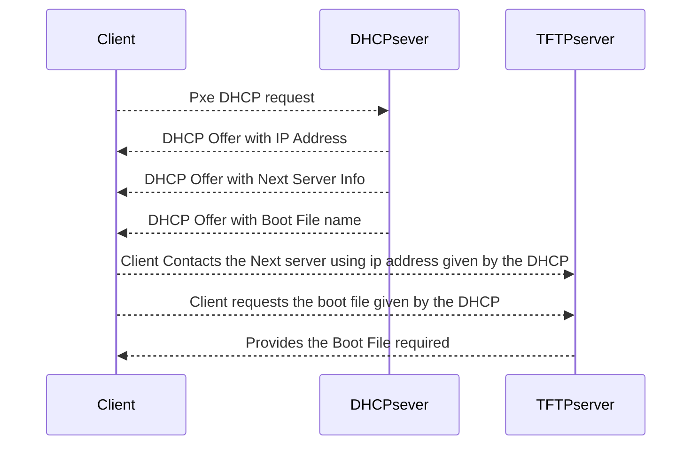

Source: (Hedgedoc.org)[https://demo.hedgedoc.org/features?both]
### Diagrams

#### UML Sequence Diagrams

You can render sequence diagrams like this:

More information about **sequence diagrams** syntax [here](https://bramp.github.io/js-sequence-diagrams/).

