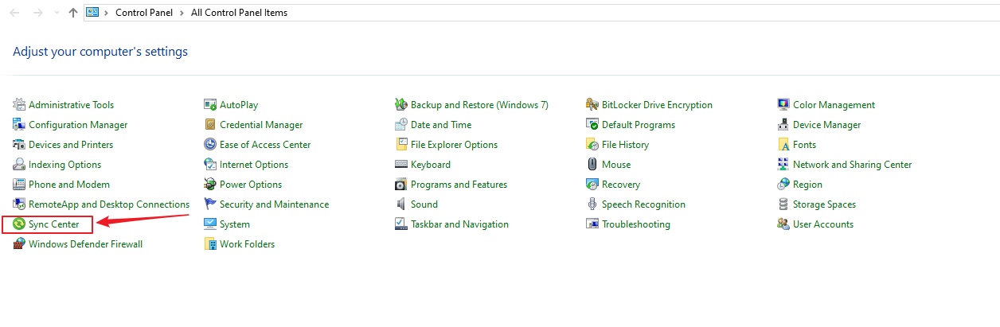

# 🔐 Inspection sécurisée de liens suspects avec Application Guard et notepad.libreops.cc

## 🎯 Objectif

Analyser des liens suspects provenant d’e-mails ou de messages **en toute sécurité**, en procédant ainsi :

1. Coller les liens dans un bloc-notes en ligne **avant** d’entrer dans le bac à sable.
2. Ouvrir **Microsoft Edge avec Application Guard**.

3. Accéder à la page du bloc-notes **depuis Edge sécurisé** pour copier les liens et les inspecter sans risque.

---

## 🧰 Prérequis

- **Windows 10/11 Professionnel ou Entreprise**
- **Microsoft Defender Application Guard** activé :
  - Ouvrir `optionalfeatures.exe` → cocher **Microsoft Defender Application Guard**
  - Redémarrer si demandé

---

## 🌐 Étapes à suivre

### 🟢 Étape 1 : Ouvrir [notepad.libreops.cc](https://notepad.libreops.cc) dans votre navigateur principal

1. Rendez-vous sur : [https://notepad.libreops.cc](https://notepad.libreops.cc)
2. Collez le ou les **liens suspects** dans la note.
3. Cliquez sur **« Save »** (en haut à droite).
4. Copiez l’**URL unique** de la note (ex. : `https://notepad.libreops.cc/xyz123abc456`)

> 💡 Vous utiliserez cette URL **dans le navigateur sécurisé** pour accéder aux liens.

---

### 🔵 Étape 2 : Ouvrir Microsoft Edge avec Application Guard

1. Lancez **Microsoft Edge**.
2. Cliquez sur le menu à trois points → **Nouvelle fenêtre Application Guard**.

> 🔐 Cela ouvre une session de navigation hautement isolée.

---

### 🔍 Étape 3 : Accéder à votre note depuis Edge sécurisé

1. Dans la fenêtre Application Guard, ouvrez l’URL copiée à l’étape 1  
   (ex. : `https://notepad.libreops.cc/xyz123abc456`)

2. Une fois la note ouverte :
   - **Copiez le lien suspect** depuis la note.
   - **Collez-le dans la barre d’adresse** ou survolez-le pour l’analyser.

3. Vous pouvez maintenant :
   - Vérifier visuellement le lien.
   - L’ouvrir **uniquement si nécessaire**.
   - Utiliser des outils d’analyse **depuis Application Guard** :
     - [VirusTotal](https://www.virustotal.com)
     - [urlscan.io](https://urlscan.io)

---

## 🧽 Après utilisation

- **Fermez la fenêtre Application Guard** pour détruire la session.

---

