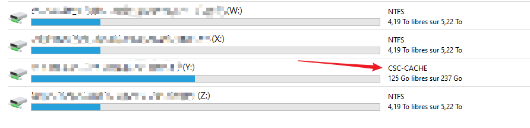

📘 Markdown Shortcuts Cheat-Sheet
📝 Basic Formatting
Bold → **text** or __text__

Italic → *text* or _text_

Bold + Italic → ***text***

Strikethrough → ~~text~~

Inline code → `text`

🧱 Code Blocks
Triple backticks:

text
undefined
code here

text
undefined
Example:

text
undefined
print("Hello World")

text
undefined
📌 Lists
Unordered
text
- Item
  - Sub-item
    - Sub-sub-item
Ordered
text
1. First
2. Second
3. Third
Task List
text
- [x] Done
- [ ] Not done
🔗 Links & Images
Link:

text
[title](https://example.com)
Image:

text

📑 Headings
text
# H1  
## H2  
### H3  
#### H4  
##### H5  
###### H6
📊 Blockquotes
text
> This is a quote  
>> Nested quote
📐 Horizontal Rule
text
---
🧩 Tables
text
| Column 1 | Column 2 |
|----------|----------|
| Value A  | Value B  |
| Value C  | Value D  |
🎨 Colors (GitHub Pages / Jekyll)
(Uses HTML because Markdown has no color support)

text
Red text
Blue text
Hex color
📦 Collapsible Sections (GitHub/Jekyll)
text

  
Click to expand

  Hidden content here.

🧭 Internal Anchor Links
text
[Go to section](#target-heading)
🎛️ HTML in Markdown
Markdown accepts embedded HTML:

text

HTML block inside markdown.

🎨 Highlight Text (Code Syntax)
text
`highlight`
