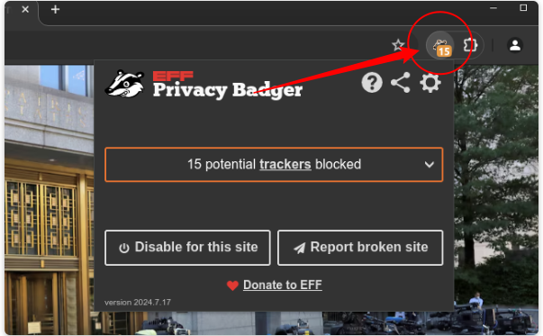
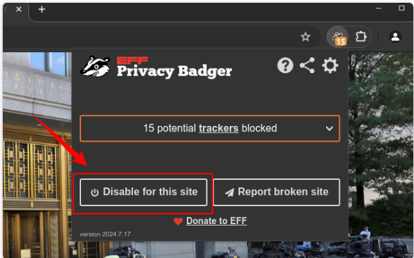

# Désactiver Privacy Badger pour un site spécifique

Ce guide explique comment désactiver temporairement **Privacy Badger** pour un seul site afin qu’il fonctionne correctement, tout en conservant la protection activée partout ailleurs.

---

## 1. Ouvrir le site
Accédez à la page Web que vous souhaitez autoriser (le site qui ne fonctionne pas lorsque Privacy Badger est actif).

---

## 2. Ouvrir la fenêtre de Privacy Badger  
Cliquez sur l’icône de Privacy Badger dans la barre d’outils de Chrome (en haut à droite) pour ouvrir son panneau.

---

## 3. Désactiver Privacy Badger pour ce site  
Dans la fenêtre, cliquez sur **« Disable for this site »** (désactiver pour ce site).  
Cette action ajoute le site à la liste blanche. Rechargez ensuite la page.

> **Astuce :** Le texte peut varier selon les versions, mais l’action reste la même — désactiver Privacy Badger pour le domaine actuel.

---

## 4. Recharger & vérifier  
- Après avoir autorisé le site, **rechargez** la page.  
- Si le problème persiste, essayez un **rechargement forcé** (**Ctrl + Maj + R**) ou **F5** ou ouvrez la page en **navigation privée**.  
- Vérifiez que le site fonctionne désormais correctement avec Privacy Badger désactivé pour ce domaine.
 