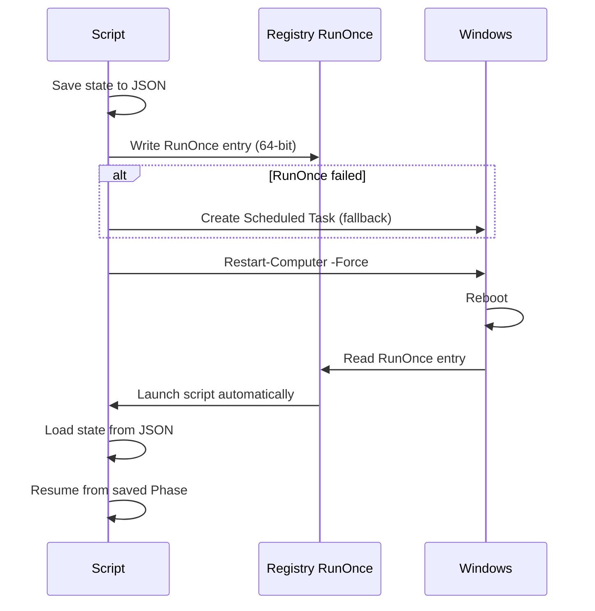
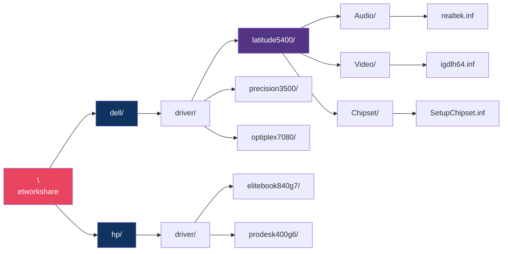
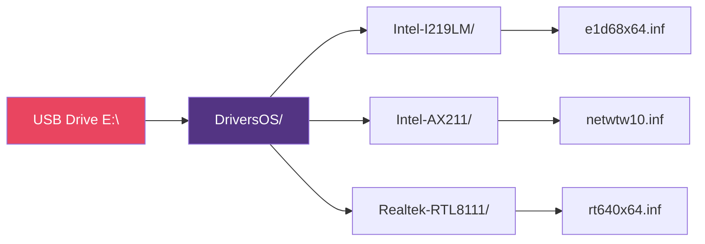

## Driver update script thats called using Autounattended xml file

## Driver update from Networkshare 

## Execution flow

```mermaid
flowchart TB
    START([🚀 Script Start]) --> INIT[Initialize-PersistentScript<br/>Copy script to C:\Temp\]
    INIT -->|Failed| FAIL_INIT([❌ Throw Error])
    INIT -->|Success| TRANSCRIPT[Start-Transcript<br/>C:\Temp\DriverUpdateScript.log]
    TRANSCRIPT --> HEADER[Display Header<br/>User, Computer, Model, Config]
    HEADER --> ORPHAN[Stop Orphan Driver Processes<br/>drvinst, pnputil, DPInst, etc.]
    ORPHAN --> LOADSTATE[Get-ScriptState<br/>Load or create state JSON]
    LOADSTATE --> SHOWSTATE[Display Current State<br/>All properties]
    SHOWSTATE --> CHECKPHASE{state.Phase?}

    %% ============================================================
    %% PHASE 0
    %% ============================================================
    CHECKPHASE -->|Phase 0| USB_CHECK{USBCompleted?}

    subgraph PHASE0A ["🔌 PHASE-0A: USB Network Drivers"]
        USB_CHECK -->|No| USB_FIND[Scan drives D: - Z:<br/>Look for DriversOS / Drivers folder]
        USB_FIND -->|Not Found| USB_SKIP[No USB folder found<br/>Skip USB phase]
        USB_FIND -->|Found| USB_INSTALL[Install-DriversFromFolder<br/>SkipDeviceMatching = TRUE<br/>Install ALL drivers from USB]
        USB_INSTALL --> USB_EACH[For each INF file:<br/>Install-SingleDriver<br/>pnputil /add-driver /install]
        USB_EACH --> USB_RESULT{NeedsReboot?}
        USB_RESULT -->|Yes| USB_REBOOT[Schedule-RebootAndContinue<br/>Set RunOnce registry<br/>Reboot in 15 seconds]
        USB_REBOOT --> REBOOT_USB([🔄 REBOOT])
        REBOOT_USB -.->|After reboot| USB_CHECK
        USB_RESULT -->|No| USB_DONE[USBCompleted = true<br/>USBRebootDone = true]
        USB_SKIP --> USB_DONE
    end

    USB_CHECK -->|Yes, not rebooted| USB_FINALIZE[Post-reboot:<br/>USB drivers finalized]
    USB_FINALIZE --> NET_CHECK
    USB_CHECK -->|Yes, rebooted| NET_CHECK
    USB_DONE --> NET_CHECK

    subgraph PHASE0B ["📡 PHASE-0B: Network Share Drivers"]
        NET_CHECK{NetworkShare<br/>Completed?}
        NET_CHECK -->|No| GUEST_CHECK{GuestAuth<br/>Configured?}

        subgraph GUESTAUTH ["🔓 SMB Guest Access Fix"]
            GUEST_CHECK -->|No| GUEST_POLICY[Create policy key if missing<br/>HKLM:\SOFTWARE\Policies\<br/>Microsoft\Windows\LanmanWorkstation]
            GUEST_POLICY --> GUEST_INSECURE[AllowInsecureGuestAuth = 1<br/>Policy + Service level]
            GUEST_INSECURE --> GUEST_SIGN1[RequireSecuritySignature = 0<br/>Disable 'always sign']
            GUEST_SIGN1 --> GUEST_SIGN2[EnableSecuritySignature = 0<br/>Disable 'sign if server agrees']
            GUEST_SIGN2 --> GUEST_RESTART[Restart LanmanWorkstation<br/>+ dependent services]
            GUEST_RESTART --> GUEST_VERIFY[Verify: Read back all 4 values<br/>Display OK/FAIL table]
            GUEST_VERIFY --> SYSINFO
        end

        GUEST_CHECK -->|Yes| SYSINFO

        subgraph MODELPATH ["🏷️ Model Detection & Path Building"]
            SYSINFO[Get-SystemInfo<br/>Manufacturer + Model]
            SYSINFO --> CLEANMODEL["Clean model name<br/>'Latitude 5400' → 'latitude5400'"]
            CLEANMODEL --> MFGFOLDER["Map manufacturer → folder<br/>'Dell Inc.' → 'dell'"]
            MFGFOLDER --> BUILDPATH["Build UNC path<br/>\\networkshare\dell\driver\latitude5400"]
        end

        BUILDPATH --> TESTSHARE[Test-NetworkShareAccess<br/>10 retries × 10s delay]
        TESTSHARE -->|Accessible| DEVSCAN
        TESTSHARE -->|Failed| TRYALT["Try alternative names:<br/>latitude-5400<br/>latitude_5400<br/>latitude 5400"]
        TRYALT -->|Found| DEVSCAN
        TRYALT -->|All failed| NET_NOTFOUND[No share folder found<br/>Skip network share phase]

        subgraph DEVMATCH ["🔍 Device Matching"]
            DEVSCAN[Get-SystemDeviceIds<br/>WMI Win32_PnPEntity<br/>Fallback: Get-PnpDevice]
            DEVSCAN --> MATCHINFS["For each INF:<br/>Parse [Manufacturer] + [Models]<br/>Extract hardware IDs"]
            MATCHINFS --> COMPARE["Compare INF IDs vs System IDs<br/>HashSet O(1) lookup"]
            COMPARE --> MATCHRESULT["Display results:<br/>Matched / Skipped / Mode"]
        end

        MATCHRESULT --> NETINSTALL[Install-DriversFromFolder<br/>Only MATCHED drivers]
        NETINSTALL --> NET_EACH["For each matched INF:<br/>Install-SingleDriver<br/>pnputil /add-driver /install<br/>Timeout monitoring<br/>Spinner animation"]
        NET_EACH --> NET_RESULT{NeedsReboot?}
        NET_RESULT -->|Yes| NET_REBOOT[Schedule-RebootAndContinue]
        NET_REBOOT --> REBOOT_NET([🔄 REBOOT])
        REBOOT_NET -.->|After reboot| NET_CHECK
        NET_RESULT -->|No| NET_DONE[NetworkShareCompleted = true<br/>Phase = 1]
        NET_NOTFOUND --> NET_DONE
    end

    NET_CHECK -->|Yes, not rebooted| NET_FINALIZE[Post-reboot:<br/>Share drivers finalized<br/>Phase = 1]
    NET_CHECK -->|Yes, rebooted| PHASE1_START
    NET_FINALIZE --> PHASE1_START
    NET_DONE --> PHASE1_START

    %% ============================================================
    %% PHASE 1
    %% ============================================================
    CHECKPHASE -->|Phase ≥ 1| PHASE1_START

    subgraph PHASE1 ["🌐 PHASE-1: Online OEM Updates"]
        PHASE1_START[PHASE 1: ONLINE OEM UPDATES]
        PHASE1_START --> INET[Test-InternetConnectivity<br/>15 retries × 10s delay<br/>HEAD https://google.com]
        INET -->|No Internet| INET_FAIL([❌ Exit 1<br/>No internet])
        INET -->|Connected| CHOCO

        subgraph CHOCO_SETUP ["🍫 Chocolatey Setup"]
            CHOCO[Install-ChocolateyIfNeeded]
            CHOCO --> CHOCO_SRC["Set-ChocolateySource<br/>Add: chocosia → choco.local.xyz.com<br/>Disable: default community source"]
        end

        CHOCO_SRC --> MFG_DETECT[Get-SystemManufacturer<br/>Win32_ComputerSystem]
        MFG_DETECT --> MFG_CHECK{Manufacturer?}

        subgraph DELL ["🖥️ Dell Updates"]
            MFG_CHECK -->|Dell| DELL_CLI[Locate dcu-cli.exe<br/>or install via Chocolatey]
            DELL_CLI -->|Not found| DELL_CHOCO["Install-ChocoPackage<br/>'dellcommandupdate'<br/>Invoke-CommandVerbose"]
            DELL_CLI -->|Found| DELL_PHASE
            DELL_CHOCO --> DELL_PHASE

            DELL_PHASE{ManufacturerPhase?}
            DELL_PHASE -->|0| DELL_ADR["Dell Phase-0: ADR<br/>Configure ADR enable<br/>dcu-cli /driverinstall<br/>Verbose output streaming"]
            DELL_ADR --> DELL_ADR_EXIT{Exit code?}
            DELL_ADR_EXIT -->|0, 3| DELL_P2
            DELL_ADR_EXIT -->|1, 5| DELL_ADR_REBOOT[Reboot required]
            DELL_ADR_REBOOT --> REBOOT_DELL([🔄 REBOOT])
            REBOOT_DELL -.-> DELL_PHASE
            DELL_ADR_EXIT -->|2, other| DELL_ADR_FAIL[ADR failed<br/>Skip to Phase-2]
            DELL_ADR_FAIL --> DELL_P2

            DELL_PHASE -->|1| DELL_SCAN["Dell Phase-1: Scan<br/>dcu-cli /scan"]
            DELL_SCAN --> DELL_P2

            DELL_P2["Dell Phase-2: Apply Updates<br/>dcu-cli /applyupdates<br/>-forceUpdate=enable<br/>-autoSuspendBitLocker=enable<br/>Verbose: each driver shown"]
            DELL_PHASE -->|2| DELL_P2
            DELL_P2 --> DELL_P2_EXIT{Exit code?}
            DELL_P2_EXIT -->|0, 3| DELL_DONE[Dell updates complete]
            DELL_P2_EXIT -->|1, 5| DELL_P2_REBOOT[Reboot required]
            DELL_P2_REBOOT --> REBOOT_DELL2([🔄 REBOOT])
            REBOOT_DELL2 -.-> DELL_PHASE
            DELL_P2_EXIT -->|other| DELL_DONE

            DELL_PHASE -->|3+| DELL_DONE
        end

        subgraph HP ["🖨️ HP Updates"]
            MFG_CHECK -->|HP| HP_CLI[Locate HPImageAssistant.exe<br/>or install via Chocolatey]
            HP_CLI -->|Not found| HP_CHOCO["Install-ChocoPackage<br/>'hpimageassistant'<br/>Invoke-CommandVerbose"]
            HP_CLI -->|Found| HP_RUN
            HP_CHOCO --> HP_RUN

            HP_RUN["HP Image Assistant<br/>/Operation:Analyze<br/>/Action:Install<br/>/Selection:All<br/>Verbose output streaming"]
            HP_RUN --> HP_EXIT{Exit code?}
            HP_EXIT -->|0| HP_DONE[HP updates complete]
            HP_EXIT -->|256, 3010| HP_REBOOT_WARN[Reboot recommended]
            HP_EXIT -->|other| HP_CONTINUE[Continue anyway]
            HP_REBOOT_WARN --> HP_DONE
            HP_CONTINUE --> HP_DONE
        end

        MFG_CHECK -->|Other| MFG_UNSUPPORTED[Unsupported manufacturer<br/>Only Dell & HP handled]
    end

    %% ============================================================
    %% FINAL
    %% ============================================================
    DELL_DONE --> FINAL
    HP_DONE --> FINAL
    MFG_UNSUPPORTED --> FINAL

    subgraph CLEANUP ["✅ Final Cleanup"]
        FINAL[Stop remaining driver processes]
        FINAL --> SUMMARY["Display Final Summary<br/>System, Model, Share path<br/>Reboots, Added, Installed<br/>Skipped, Failed, Timed out<br/>Total time"]
        SUMMARY --> REMOVESTATE["Remove-ScriptState<br/>Delete state JSON<br/>Delete RunOnce registry<br/>Delete scheduled task"]
    end

    REMOVESTATE --> DONE([✅ Script Complete])

    %% ============================================================
    %% ERROR HANDLING
    %% ============================================================
    FAIL_INIT --> CATCH
    subgraph ERRORHANDLER ["❌ Error Handler"]
        CATCH[Catch block<br/>Display error message + line<br/>Display stack trace]
        CATCH --> EMERGENCY[Emergency cleanup<br/>Stop all driver processes<br/>ErrorAction = SilentlyContinue]
        EMERGENCY --> KEEPSTATE[State file kept<br/>Re-run script to continue]
    end
    KEEPSTATE --> FINALLY

    DONE --> FINALLY
    FINALLY[Finally block<br/>Stop-Transcript]

    %% ============================================================
    %% INSTALL-SINGLEDRIVER DETAIL
    %% ============================================================
    subgraph SINGLEDRIVER ["⚙️ Install-SingleDriver (called per INF)"]
        direction TB
        SD_START[Write driver header<br/>Progress bar + name] --> SD_CLEAN[Clear-DriverInstallEnvironment<br/>Kill leftover processes]
        SD_CLEAN --> SD_WRAPPER["Create wrapper .ps1<br/>Runs pnputil in child process"]
        SD_WRAPPER --> SD_SPAWN["Start-Process powershell<br/>-WindowStyle Hidden"]
        SD_SPAWN --> SD_MONITOR["Monitor loop:<br/>Spinner animation<br/>Elapsed/Remaining timer<br/>Check timeout"]
        SD_MONITOR --> SD_TIMEOUT{Timed out?}
        SD_TIMEOUT -->|Yes| SD_KILL["Kill process<br/>Stop-DriverInstallProcesses<br/>Return TimedOut result"]
        SD_TIMEOUT -->|No| SD_READ["Read output file<br/>Read exit code file"]
        SD_READ --> SD_PARSE["Parse pnputil output:<br/>added / installed /<br/>already exists / reboot"]
        SD_PARSE --> SD_EXIT["Evaluate exit code:<br/>0=OK, 1=warn, 259=staged<br/>3010=reboot, 482=partial"]
        SD_EXIT --> SD_RETURN[Return result object]
    end

    %% ============================================================
    %% INVOKE-COMMANDVERBOSE DETAIL
    %% ============================================================
    subgraph VERBOSE ["📺 Invoke-CommandVerbose (used by Dell/HP/Choco)"]
        direction TB
        V_START[Start process with<br/>RedirectStdout + Stderr] --> V_LOOP["Async ReadLineAsync loop:<br/>stdout → White text<br/>stderr → Yellow text<br/>Each line timestamped"]
        V_LOOP --> V_HEARTBEAT["If silent >30s:<br/>Print heartbeat message<br/>'...still running (120s)'"]
        V_HEARTBEAT --> V_DONE["Process exits<br/>Save full log to C:\Temp\<br/>Display duration + exit code"]
    end

    %% ============================================================
    %% STYLING
    %% ============================================================
    classDef phase fill:#c9f1f5,stroke:#e94560,color:#fff,stroke-width:2px
    classDef success fill:#0bd979,stroke:#00ff88,color:#fff,stroke-width:2px
    classDef reboot fill:#533483,stroke:#ffcc00,color:#fff,stroke-width:2px
    classDef error fill:#4a0000,stroke:#ff0000,color:#fff,stroke-width:2px
    classDef decision fill:#26948b,stroke:#0f3460,color:#fff,stroke-width:1px
    classDef process fill:#c9f1f5,stroke:#e2e2e2,color:#fff,stroke-width:1px

    class START,DONE success
    class REBOOT_USB,REBOOT_NET,REBOOT_DELL,REBOOT_DELL2 reboot
    class FAIL_INIT,INET_FAIL,CATCH error
    class CHECKPHASE,USB_CHECK,NET_CHECK,GUEST_CHECK,MFG_CHECK,DELL_PHASE,USB_RESULT,NET_RESULT,DELL_ADR_EXIT,DELL_P2_EXIT,HP_EXIT,SD_TIMEOUT decision
```



## Reboot Flow


## Network Share Folder Structure



## USB Stick Structure (Minimal)



## Powershell Script That searches the network share for drivers

```powershell
#Requires -RunAsAdministrator
Set-StrictMode -Version Latest
$ErrorActionPreference = 'Stop'

#===================================================================
#  CONFIGURATION
#===================================================================
$Script:TempFolder       = "C:\Temp"
$Script:PersistentScript = "C:\Temp\DriverUpdateScript.ps1"
$Script:StateFile        = "C:\Temp\DriverUpdateState.json"
$Script:LogFile          = "C:\Temp\DriverUpdateScript.log"
$Script:RunOnceKey       = 'HKLM:\SOFTWARE\Microsoft\Windows\CurrentVersion\RunOnce'
$Script:RunOnceName      = 'DriverUpdateScript_RunOnce'
$Script:DriverTimeout    = 300
$Script:CooldownSeconds  = 5
$Script:DriverProcesses  = @('drvinst','pnputil','DPInst','DPInst64','SetupAPI')
$Script:SpinnerFrames    = @('[ ]','[= ]','[== ]','[=== ]','[====]','[ ===]','[ ==]','[ =]')
$Script:ChocoSourceName  = 'chocosia'
$Script:ChocoSourceUrl   = 'http://choco.local.iut-troyes.univ-reims.fr/repository/chocolatey-group'
$Script:NetworkShareBase    = '\\synosia.local.iut-troyes.univ-reims.fr\batchs'
$Script:ShareDriverFolder   = 'driver'
$Script:ManufacturerShareMap = @{
    'Dell'             = 'dell'
    'Dell Inc.'        = 'dell'
    'HP'               = 'hp'
    'Hewlett-Packard'  = 'hp'
}
$Script:USBDriverFolders = @('DriversOS','Drivers')

#===================================================================
#  LOGGING HELPERS
#===================================================================
function Append-ToLog {
    param([Parameter(Mandatory=$false)][AllowEmptyString()][string]$Message = "")
    # No-op: Start-Transcript captures all console output automatically
}

function Write-Status {
    param(
        [Parameter(Mandatory)]
        [ValidateSet('ERROR','WARN','INFO','STEP','OK','PROGRESS','DEBUG','DRIVER','TIME','SKIP','KILL')]
        [string]$Level,
        [Parameter(Mandatory)][string]$Message
    )
    $timestamp = Get-Date -Format "HH:mm:ss"
    $color = switch ($Level.ToUpper()) {
        'ERROR'    { 'Red' }
        'WARN'     { 'Yellow' }
        'INFO'     { 'Cyan' }
        'STEP'     { 'Magenta' }
        'OK'       { 'Green' }
        'PROGRESS' { 'White' }
        'DEBUG'    { 'DarkGray' }
        'DRIVER'   { 'Blue' }
        'TIME'     { 'DarkYellow' }
        'SKIP'     { 'DarkMagenta' }
        'KILL'     { 'Red' }
        default    { 'White' }
    }
    $prefix = switch ($Level.ToUpper()) {
        'ERROR'    { '[X]' }
        'WARN'     { '[!]' }
        'INFO'     { '[i]' }
        'STEP'     { '[>]' }
        'OK'       { '[+]' }
        'PROGRESS' { '[o]' }
        'DEBUG'    { '[.]' }
        'DRIVER'   { '[D]' }
        'TIME'     { '[T]' }
        'SKIP'     { '[S]' }
        'KILL'     { '[K]' }
        default    { '[ ]' }
    }
    $line = "[$timestamp] $prefix [$Level] $Message"
    Write-Host $line -ForegroundColor $color
}

function Write-Banner {
    param([string]$Text)
    $sep = "=" * 70
    Write-Host ""
    Write-Host $sep -ForegroundColor Magenta
    Write-Host "  $Text" -ForegroundColor Magenta
    Write-Host $sep -ForegroundColor Magenta
    Write-Host ""
}

function Write-SubBanner {
    param([string]$Text)
    Write-Host ""
    Write-Host "--- $Text ---" -ForegroundColor Yellow
    Write-Host ""
}

function Write-LoggedHost {
    param(
        [Parameter(Mandatory=$false)][AllowEmptyString()][string]$Message = "",
        [string]$ForegroundColor = 'White'
    )
    if ($Message) {
        Write-Host $Message -ForegroundColor $ForegroundColor
    }
    else {
        Write-Host ""
    }
}

function Format-Duration {
    param([double]$Seconds)
    if ($Seconds -lt 60) { return "{0:N1}s" -f $Seconds }
    elseif ($Seconds -lt 3600) {
        $m = [math]::Floor($Seconds / 60); $s = $Seconds % 60
        return "{0}m {1:N0}s" -f $m, $s
    }
    else {
        $h = [math]::Floor($Seconds / 3600); $m = [math]::Floor(($Seconds % 3600) / 60)
        return "{0}h {1}m" -f $h, $m
    }
}

function Get-ConsoleWidth {
    $w = 100
    try { $w = [Console]::WindowWidth - 5; if ($w -lt 50) { $w = 100 } } catch { }
    return $w
}

function Write-DriverHeader {
    param([string]$DriverName, [int]$Current, [int]$Total)
    if ($Total -le 0) { $Total = 1 }
    $pct = [math]::Round(($Current / $Total) * 100)
    $filled = [math]::Floor($pct / 5)
    $empty = 20 - $filled
    $bar = "[" + ("#" * $filled) + ("-" * $empty) + "]"
    $lines = @(
        "  ======================================================================"
        "  $bar $pct% ($Current of $Total drivers)"
        "  Driver: $DriverName"
        "  Timeout: $Script:DriverTimeout seconds"
        "  ======================================================================"
    )
    Write-Host ""
    foreach ($l in $lines) {
        Write-Host $l -ForegroundColor DarkCyan
    }
}

#===================================================================
#  INITIALISATION
#===================================================================
function Initialize-PersistentScript {
    if (-not (Test-Path $Script:TempFolder)) {
        New-Item -Path $Script:TempFolder -ItemType Directory -Force | Out-Null
    }
    $sessionHeader = @(
        ""
        "=================================================================="
        "  NEW SESSION: $(Get-Date -Format 'yyyy-MM-dd HH:mm:ss')"
        "  PID: $PID | User: $env:USERNAME | Computer: $env:COMPUTERNAME"
        "=================================================================="
        ""
    )
    foreach ($line in $sessionHeader) {
        Write-Host $line -ForegroundColor DarkGray
    }
    $currentScript = $MyInvocation.ScriptName
    if (-not $currentScript) { $currentScript = $PSCommandPath }
    if ($currentScript -and $currentScript -ne $Script:PersistentScript) {
        if (Test-Path $currentScript) {
            Write-LoggedHost "[INIT] Copying script to $Script:PersistentScript" -ForegroundColor Yellow
            Copy-Item -Path $currentScript -Destination $Script:PersistentScript -Force
            Write-LoggedHost "[INIT] Script copied successfully." -ForegroundColor Green
        }
    }
    if (-not (Test-Path $Script:PersistentScript)) {
        Write-LoggedHost "[ERROR] Persistent script could not be created." -ForegroundColor Red
        return $false
    }
    return $true
}

#===================================================================
#  PROCESS-HANDLING HELPERS
#===================================================================
function Get-DriverInstallProcesses {
    [System.Collections.ArrayList]$collector = @()
    foreach ($name in $Script:DriverProcesses) {
        $found = $null
        try { $found = Get-Process -Name $name -ErrorAction SilentlyContinue } catch { }
        if ($null -ne $found) {
            foreach ($p in @($found)) { [void]$collector.Add($p) }
        }
    }
    $arr = [object[]]$collector.ToArray()
    return ,$arr
}

function Stop-DriverInstallProcesses {
    param([switch]$Silent)
    $killed = 0
    foreach ($name in $Script:DriverProcesses) {
        $found = $null
        try { $found = Get-Process -Name $name -ErrorAction SilentlyContinue } catch { }
        if ($null -ne $found) {
            foreach ($proc in @($found)) {
                if (-not $Silent) {
                    Write-Status KILL "Terminating: $($proc.ProcessName) (PID $($proc.Id))"
                }
                try { $proc.CloseMainWindow() | Out-Null } catch { }
                Start-Sleep -Milliseconds 300
                try {
                    if (-not $proc.HasExited) { Stop-Process -Id $proc.Id -Force -ErrorAction SilentlyContinue }
                } catch { }
                $killed++
            }
        }
    }
    foreach ($name in $Script:DriverProcesses) {
        try {
            $saveEA = $ErrorActionPreference
            $ErrorActionPreference = 'SilentlyContinue'
            $null = cmd.exe /c "taskkill /F /IM `"$name.exe`" >nul 2>&1"
            $ErrorActionPreference = $saveEA
        }
        catch { try { $ErrorActionPreference = $saveEA } catch { } }
    }
    return $killed
}

function Wait-ForDriverProcesses {
    param([int]$TimeoutSeconds = 30)
    $sw = [System.Diagnostics.Stopwatch]::StartNew()
    while ($sw.Elapsed.TotalSeconds -lt $TimeoutSeconds) {
        $procs = Get-DriverInstallProcesses
        $procCount = ($procs | Measure-Object).Count
        if ($procCount -eq 0) { return $true }
        Start-Sleep -Milliseconds 500
    }
    return $false
}

function Clear-DriverInstallEnvironment {
    $procs = Get-DriverInstallProcesses
    $procCount = ($procs | Measure-Object).Count
    if ($procCount -gt 0) {
        Write-Status WARN "Found $procCount leftover driver process(es) - cleaning up..."
        $k = Stop-DriverInstallProcesses
        Write-Status INFO "Terminated $k process(es)"
        Start-Sleep -Seconds 2
    }
}

#===================================================================
#  EXECUTABLE FINDER (validates file, not directory)
#===================================================================
function Find-Executable {
    param(
        [Parameter(Mandatory)][string]$FileName,
        [Parameter(Mandatory)][string[]]$KnownPaths,
        [string[]]$SearchRoots = @(),
        [string]$Label = "executable"
    )

    # 1 - Check known paths (MUST be a file, not a directory)
    foreach ($p in $KnownPaths) {
        if (Test-Path $p -PathType Leaf) {
            Write-Status OK "Found $Label at known path: $p"
            return $p
        }
    }
    Write-Status INFO "$Label not found at known paths."

    # 2 - Search Chocolatey lib folder
    $chocoLib = "$env:ProgramData\chocolatey\lib"
    if (Test-Path $chocoLib) {
        Write-Status INFO "Searching Chocolatey lib for $FileName..."
        $found = Get-ChildItem -Path $chocoLib -Filter $FileName -Recurse -File -ErrorAction SilentlyContinue | Select-Object -First 1
        if ($found) {
            Write-Status OK "Found $Label in Chocolatey: $($found.FullName)"
            return $found.FullName
        }
    }

    # 3 - Search Chocolatey bin for shims
    $chocoBin = "$env:ProgramData\chocolatey\bin"
    if (Test-Path $chocoBin) {
        $shimPath = Join-Path $chocoBin $FileName
        if (Test-Path $shimPath -PathType Leaf) {
            Write-Status OK "Found $Label shim: $shimPath"
            return $shimPath
        }
    }

    # 4 - Search provided root directories
    $defaultRoots = @(
        'C:\Program Files'
        'C:\Program Files (x86)'
        $env:ProgramData
        'C:\HP'
        'C:\SWSetup'
        'C:\Dell'
    )
    $allRoots = @($SearchRoots) + $defaultRoots | Select-Object -Unique
    foreach ($root in $allRoots) {
        if (-not (Test-Path $root)) { continue }
        Write-Status DEBUG "Searching $root for $FileName..."
        $found = Get-ChildItem -Path $root -Filter $FileName -Recurse -File -ErrorAction SilentlyContinue | Select-Object -First 1
        if ($found) {
            Write-Status OK "Found $Label via search: $($found.FullName)"
            return $found.FullName
        }
    }

    Write-Status WARN "$Label ($FileName) not found anywhere."
    return $null
}

#===================================================================
#  VERBOSE COMMAND EXECUTION
#===================================================================
function Invoke-CommandVerbose {
    param(
        [Parameter(Mandatory)][string]$FilePath,
        [Parameter(Mandatory)][string]$Arguments,
        [Parameter(Mandatory)][string]$Label
    )

    # Validate: must exist AND be a file (not a directory)
    if (-not (Test-Path $FilePath -PathType Leaf)) {
        Write-Status ERROR "Executable not found or is a directory: $FilePath"
        return 999
    }

    $exeName = Split-Path $FilePath -Leaf
    Write-Status INFO "Executing: $exeName $Arguments"
    Write-Status DEBUG "Full path: $FilePath"

    $psi = [System.Diagnostics.ProcessStartInfo]::new()
    $psi.FileName = $FilePath
    $psi.Arguments = $Arguments
    $psi.UseShellExecute = $false
    $psi.RedirectStandardOutput = $true
    $psi.RedirectStandardError = $true
    $psi.CreateNoWindow = $true
    $process = [System.Diagnostics.Process]::new()
    $process.StartInfo = $psi
    try { $null = $process.Start() }
    catch {
        Write-Status ERROR "Failed to start $exeName : $($_.Exception.Message)"
        return 999
    }
    $sw = [System.Diagnostics.Stopwatch]::StartNew()
    $lastActivity = [System.Diagnostics.Stopwatch]::StartNew()
    $heartbeatSec = 30
    $logLines = [System.Collections.ArrayList]::new()
    $stdoutTask = $process.StandardOutput.ReadLineAsync()
    $stderrTask = $process.StandardError.ReadLineAsync()
    $stdoutDone = $false
    $stderrDone = $false
    while ((-not $stdoutDone) -or (-not $stderrDone)) {
        $activity = $false
        if ((-not $stdoutDone) -and $stdoutTask.IsCompleted) {
            $line = $null
            try { $line = $stdoutTask.Result } catch { $stdoutDone = $true; continue }
            if ($null -ne $line) {
                $trimmed = $line.Trim()
                if ($trimmed) {
                    $ts = Get-Date -Format 'HH:mm:ss'
                    $formatted = "  [$ts] [$Label] $trimmed"
                    Write-Host $formatted -ForegroundColor White
                    [void]$logLines.Add("[$ts] $trimmed")
                }
                $stdoutTask = $process.StandardOutput.ReadLineAsync()
                $activity = $true; $lastActivity.Restart()
            }
            else { $stdoutDone = $true }
        }
        if ((-not $stderrDone) -and $stderrTask.IsCompleted) {
            $line = $null
            try { $line = $stderrTask.Result } catch { $stderrDone = $true; continue }
            if ($null -ne $line) {
                $trimmed = $line.Trim()
                if ($trimmed) {
                    $ts = Get-Date -Format 'HH:mm:ss'
                    $formatted = "  [$ts] [$Label] [STDERR] $trimmed"
                    Write-Host $formatted -ForegroundColor Yellow
                    [void]$logLines.Add("[$ts] [STDERR] $trimmed")
                }
                $stderrTask = $process.StandardError.ReadLineAsync()
                $activity = $true; $lastActivity.Restart()
            }
            else { $stderrDone = $true }
        }
        if ((-not $activity) -and ($lastActivity.Elapsed.TotalSeconds -ge $heartbeatSec)) {
            $ts = Get-Date -Format 'HH:mm:ss'
            $elapsed = [math]::Round($sw.Elapsed.TotalSeconds)
            $heartbeatMsg = "  [$ts] [$Label] ... still running (${elapsed}s elapsed)"
            Write-Host $heartbeatMsg -ForegroundColor DarkGray
            [void]$logLines.Add("[$ts] [heartbeat] ${elapsed}s elapsed")
            $lastActivity.Restart()
        }
        if (-not $activity) { Start-Sleep -Milliseconds 100 }
    }
    $process.WaitForExit()
    $sw.Stop()
    $exitCode = $process.ExitCode
    $safeLabel = $Label -replace '[^a-zA-Z0-9]', '_'
    $cmdLogFile = Join-Path $Script:TempFolder "${safeLabel}_$(Get-Date -Format 'yyyyMMdd_HHmmss').log"
    try {
        $header = "Command : $FilePath $Arguments`nExit    : $exitCode`nDuration: $(Format-Duration $sw.Elapsed.TotalSeconds)`n$('=' * 60)`n"
        $body = ($logLines | ForEach-Object { $_ }) -join "`n"
        "$header$body" | Out-File $cmdLogFile -Encoding UTF8 -Force
    } catch { }
    Write-Status TIME "Completed in $(Format-Duration $sw.Elapsed.TotalSeconds)"
    Write-Status INFO "Exit code: $exitCode"
    Write-Status DEBUG "Per-command log: $cmdLogFile"
    try { $process.Dispose() } catch { }
    return $exitCode
}

function Get-ChocoExePath {
    $cmd = Get-Command choco -ErrorAction SilentlyContinue
    if ($null -ne $cmd) { return $cmd.Source }
    $default = "$env:ProgramData\chocolatey\bin\choco.exe"
    if (Test-Path $default) { return $default }
    return $null
}

#===================================================================
#  SMB GUEST AUTH & SIGNING FIX
#===================================================================
function Enable-GuestNetworkAccess {
    Write-SubBanner "Configuring SMB Guest Access & Signing"
    Write-Status INFO "Windows 11 blocks guest SMB access by default."
    Write-Status INFO "Applying registry fixes..."
    $policyPath = 'HKLM:\SOFTWARE\Policies\Microsoft\Windows\LanmanWorkstation'
    $servicePath = 'HKLM:\SYSTEM\CurrentControlSet\Services\LanmanWorkstation\Parameters'
    $changes = 0
    if (-not (Test-Path $policyPath)) {
        Write-Status INFO "Creating policy key: $policyPath"
        try {
            New-Item -Path 'HKLM:\SOFTWARE\Policies\Microsoft\Windows' -Name 'LanmanWorkstation' -Force | Out-Null
            Write-Status OK "Policy key created."
            $changes++
        }
        catch { Write-Status ERROR "Failed to create policy key: $($_.Exception.Message)" }
    }
    else { Write-Status OK "Policy key exists." }
    try {
        $currentVal = $null
        try { $currentVal = Get-ItemPropertyValue -Path $policyPath -Name 'AllowInsecureGuestAuth' -ErrorAction SilentlyContinue } catch { }
        if ($currentVal -eq 1) { Write-Status OK "AllowInsecureGuestAuth (policy) already 1." }
        else {
            Set-ItemProperty -Path $policyPath -Name 'AllowInsecureGuestAuth' -Value 1 -Type DWord -Force
            Write-Status OK "AllowInsecureGuestAuth (policy) set to 1."
            $changes++
        }
    }
    catch { Write-Status ERROR "Failed: $($_.Exception.Message)" }
    try {
        $currentVal = $null
        try { $currentVal = Get-ItemPropertyValue -Path $servicePath -Name 'AllowInsecureGuestAuth' -ErrorAction SilentlyContinue } catch { }
        if ($currentVal -eq 1) { Write-Status OK "AllowInsecureGuestAuth (service) already 1." }
        else {
            Set-ItemProperty -Path $servicePath -Name 'AllowInsecureGuestAuth' -Value 1 -Type DWord -Force
            Write-Status OK "AllowInsecureGuestAuth (service) set to 1."
            $changes++
        }
    }
    catch { Write-Status ERROR "Failed: $($_.Exception.Message)" }
    try {
        $currentVal = $null
        try { $currentVal = Get-ItemPropertyValue -Path $servicePath -Name 'RequireSecuritySignature' -ErrorAction SilentlyContinue } catch { }
        if ($currentVal -eq 0) { Write-Status OK "RequireSecuritySignature already 0." }
        else {
            Set-ItemProperty -Path $servicePath -Name 'RequireSecuritySignature' -Value 0 -Type DWord -Force
            Write-Status OK "RequireSecuritySignature set to 0."
            $changes++
        }
    }
    catch { Write-Status ERROR "Failed: $($_.Exception.Message)" }
    try {
        $currentVal = $null
        try { $currentVal = Get-ItemPropertyValue -Path $servicePath -Name 'EnableSecuritySignature' -ErrorAction SilentlyContinue } catch { }
        if ($currentVal -eq 0) { Write-Status OK "EnableSecuritySignature already 0." }
        else {
            Set-ItemProperty -Path $servicePath -Name 'EnableSecuritySignature' -Value 0 -Type DWord -Force
            Write-Status OK "EnableSecuritySignature set to 0."
            $changes++
        }
    }
    catch { Write-Status ERROR "Failed: $($_.Exception.Message)" }
    if ($changes -gt 0) {
        Write-Status INFO "Restarting LanmanWorkstation service ($changes changes)..."
        try {
            $saveEA = $ErrorActionPreference
            $ErrorActionPreference = 'SilentlyContinue'
            $null = cmd.exe /c "net stop LanmanWorkstation /y >nul 2>&1"
            Start-Sleep -Seconds 2
            $null = cmd.exe /c "net start LanmanWorkstation >nul 2>&1"
            $null = cmd.exe /c "net start LanmanServer >nul 2>&1"
            $null = cmd.exe /c "net start Netlogon >nul 2>&1"
            $ErrorActionPreference = $saveEA
            Start-Sleep -Seconds 3
            Write-Status OK "LanmanWorkstation restarted."
        }
        catch {
            try { $ErrorActionPreference = $saveEA } catch { }
            Write-Status WARN "Service restart may need reboot."
        }
    }
    else { Write-Status OK "No changes needed." }
    $readBack = @(
        @{ Name = 'AllowInsecureGuestAuth (policy)';  Path = $policyPath;  Key = 'AllowInsecureGuestAuth'; Expected = 1 }
        @{ Name = 'AllowInsecureGuestAuth (service)'; Path = $servicePath; Key = 'AllowInsecureGuestAuth'; Expected = 1 }
        @{ Name = 'RequireSecuritySignature';         Path = $servicePath; Key = 'RequireSecuritySignature'; Expected = 0 }
        @{ Name = 'EnableSecuritySignature';          Path = $servicePath; Key = 'EnableSecuritySignature'; Expected = 0 }
    )
    Write-LoggedHost
    Write-LoggedHost "  ======================================================================" -ForegroundColor DarkCyan
    Write-LoggedHost "              SMB GUEST ACCESS VERIFICATION" -ForegroundColor Cyan
    Write-LoggedHost "  ======================================================================" -ForegroundColor DarkCyan
    foreach ($item in $readBack) {
        $val = $null
        try { $val = Get-ItemPropertyValue -Path $item.Path -Name $item.Key -ErrorAction SilentlyContinue } catch { }
        $valStr = if ($null -ne $val) { $val.ToString() } else { 'NOT SET' }
        $match = ($val -eq $item.Expected)
        $statusColor = if ($match) { 'Green' } else { 'Red' }
        $statusIcon = if ($match) { 'OK' } else { 'FAIL' }
        Write-LoggedHost "  [$statusIcon] $($item.Name): $valStr (expected: $($item.Expected))" -ForegroundColor $statusColor
    }
    Write-LoggedHost "  Changes applied: $changes" -ForegroundColor White
    Write-LoggedHost "  ======================================================================" -ForegroundColor DarkCyan
    Write-LoggedHost
    return ($changes -ge 0)
}

#===================================================================
#  SYSTEM MODEL & NETWORK SHARE PATH HELPERS
#===================================================================
function Get-SystemInfo {
    $cs = Get-CimInstance Win32_ComputerSystem
    $rawManufacturer = $cs.Manufacturer.Trim()
    $rawModel = $cs.Model.Trim()
    $cleanModel = ($rawModel -replace '\s', '').ToLower()
    return [PSCustomObject]@{
        RawManufacturer = $rawManufacturer
        RawModel        = $rawModel
        CleanModel      = $cleanModel
    }
}

function Get-ManufacturerShareFolder {
    param([Parameter(Mandatory)][string]$Manufacturer)
    foreach ($key in $Script:ManufacturerShareMap.Keys) {
        if ($Manufacturer -like "*$key*") { return $Script:ManufacturerShareMap[$key] }
    }
    return ($Manufacturer -replace '\s', '').ToLower()
}

function Build-NetworkDriverPath {
    param([Parameter(Mandatory)][string]$ManufacturerFolder, [Parameter(Mandatory)][string]$CleanModel)
    $path = Join-Path $Script:NetworkShareBase $ManufacturerFolder
    $path = Join-Path $path $Script:ShareDriverFolder
    $path = Join-Path $path $CleanModel
    return $path
}

function Test-NetworkShareAccess {
    param([Parameter(Mandatory)][string]$SharePath, [int]$MaxRetries = 10, [int]$RetryDelaySec = 10)
    Write-Status INFO "Testing access to: $SharePath"
    for ($i = 1; $i -le $MaxRetries; $i++) {
        try {
            if (Test-Path $SharePath -ErrorAction Stop) {
                Write-Status OK "Network share accessible: $SharePath"
                return $true
            }
        }
        catch { }
        if ($i -lt $MaxRetries) {
            Write-Status WARN "Attempt $i/$MaxRetries failed - waiting ${RetryDelaySec}s..."
            Start-Sleep -Seconds $RetryDelaySec
        }
    }
    Write-Status ERROR "Share not accessible after $MaxRetries attempts: $SharePath"
    return $false
}

#===================================================================
#  DEVICE SCANNING & INF MATCHING
#===================================================================
function Get-SystemDeviceIds {
    $ids = [System.Collections.Generic.HashSet[string]]::new([System.StringComparer]::OrdinalIgnoreCase)
    $deviceCount = 0
    $problemDeviceNames = [System.Collections.ArrayList]::new()
    try {
        $devices = @(Get-CimInstance Win32_PnPEntity -ErrorAction Stop)
        $deviceCount = ($devices | Measure-Object).Count
        foreach ($dev in $devices) {
            if ($null -ne $dev.HardwareID) { foreach ($hwid in @($dev.HardwareID)) { if ($hwid) { [void]$ids.Add($hwid) } } }
            if ($null -ne $dev.CompatibleID) { foreach ($cid in @($dev.CompatibleID)) { if ($cid) { [void]$ids.Add($cid) } } }
            if ($null -ne $dev.ConfigManagerErrorCode -and $dev.ConfigManagerErrorCode -ne 0) {
                $devName = $dev.Name; if (-not $devName) { $devName = $dev.DeviceID }
                [void]$problemDeviceNames.Add("$devName (error $($dev.ConfigManagerErrorCode))")
            }
        }
    }
    catch { Write-Status WARN "WMI scan failed: $($_.Exception.Message)" }
    if ($ids.Count -eq 0) {
        try {
            $pnpDevs = @(Get-PnpDevice -ErrorAction SilentlyContinue)
            $deviceCount = ($pnpDevs | Measure-Object).Count
            foreach ($dev in $pnpDevs) {
                try {
                    $hwProp = $dev | Get-PnpDeviceProperty -KeyName 'DEVPKEY_Device_HardwareIds' -ErrorAction SilentlyContinue
                    if ($null -ne $hwProp -and $null -ne $hwProp.Data) { foreach ($id in @($hwProp.Data)) { if ($id) { [void]$ids.Add($id) } } }
                } catch { }
                try {
                    $cProp = $dev | Get-PnpDeviceProperty -KeyName 'DEVPKEY_Device_CompatibleIds' -ErrorAction SilentlyContinue
                    if ($null -ne $cProp -and $null -ne $cProp.Data) { foreach ($id in @($cProp.Data)) { if ($id) { [void]$ids.Add($id) } } }
                } catch { }
            }
        } catch { }
    }
    Write-Status OK "Scanned $deviceCount device(s), $($ids.Count) unique ID(s)."
    $probCount = ($problemDeviceNames | Measure-Object).Count
    if ($probCount -gt 0) {
        Write-Status WARN "$probCount device(s) with problems:"
        foreach ($pd in $problemDeviceNames) { Write-Status INFO "  - $pd" }
    }
    return $ids
}

function Get-InfHardwareIds {
    param([Parameter(Mandatory)][string]$InfPath)
    $hardwareIds = [System.Collections.Generic.HashSet[string]]::new([System.StringComparer]::OrdinalIgnoreCase)
    try { $lines = @(Get-Content $InfPath -ErrorAction Stop) } catch { return @($hardwareIds) }
    $lineCount = ($lines | Measure-Object).Count
    if ($lineCount -eq 0) { return @($hardwareIds) }
    $modelSections = [System.Collections.Generic.HashSet[string]]::new([System.StringComparer]::OrdinalIgnoreCase)
    $inManufacturer = $false
    foreach ($line in $lines) {
        $trimmed = $line.Trim()
        if ($trimmed.StartsWith(';')) { continue }
        if ($trimmed -match '^\[Manufacturer\]\s*$') { $inManufacturer = $true; continue }
        if ($inManufacturer) {
            if ($trimmed -match '^\[') { $inManufacturer = $false; continue }
            if (-not $trimmed) { continue }
            if ($trimmed -match '=') {
                $rightSide = ($trimmed -split '=', 2)[1]
                if ($null -eq $rightSide) { continue }
                $parts = $rightSide -split ','
                $baseName = $parts[0].Trim()
                if (-not $baseName) { continue }
                [void]$modelSections.Add($baseName)
                $partCount = ($parts | Measure-Object).Count
                for ($j = 1; $j -lt $partCount; $j++) {
                    $decoration = $parts[$j].Trim()
                    if ($decoration) { [void]$modelSections.Add("$baseName.$decoration") }
                }
            }
        }
    }
    foreach ($section in @($modelSections)) {
        $sectionHeader = "[$section]"
        $inSection = $false
        foreach ($line in $lines) {
            $trimmed = $line.Trim()
            if ($trimmed.StartsWith(';')) { continue }
            if ($trimmed -ieq $sectionHeader) { $inSection = $true; continue }
            if ($inSection) {
                if ($trimmed -match '^\[') { $inSection = $false; continue }
                if (-not $trimmed) { continue }
                if ($trimmed -match '=') {
                    $rightSide = ($trimmed -split '=', 2)[1]
                    if ($null -eq $rightSide) { continue }
                    $idParts = $rightSide -split ','
                    $idPartCount = ($idParts | Measure-Object).Count
                    for ($j = 1; $j -lt $idPartCount; $j++) {
                        $hwid = $idParts[$j].Trim().Trim('"').Trim()
                        if ($hwid -and $hwid -match '\\') { [void]$hardwareIds.Add($hwid) }
                    }
                }
            }
        }
    }
    return @($hardwareIds)
}

function Test-InfMatchesSystem {
    param([Parameter(Mandatory)][string]$InfPath, [Parameter(Mandatory)][System.Collections.Generic.HashSet[string]]$SystemIds)
    $infIds = Get-InfHardwareIds -InfPath $InfPath
    $infIdCount = ($infIds | Measure-Object).Count
    if ($infIdCount -eq 0) { return $true }
    foreach ($infId in $infIds) { if ($SystemIds.Contains($infId)) { return $true } }
    return $false
}

#===================================================================
#  STATE-MANAGEMENT
#===================================================================
function Get-ScriptState {
    if (Test-Path $Script:StateFile) {
        try {
            $json = Get-Content $Script:StateFile -Raw -ErrorAction Stop | ConvertFrom-Json
            $defaults = @{
                Phase = 0; USBCompleted = $false; USBRebootDone = $false
                NetworkShareCompleted = $false; NetworkShareRebootDone = $false
                NetworkSharePath = ""; NetworkShareProcessedDrivers = @()
                USBProcessedDrivers = @(); USBDriverRoot = ""
                ManufacturerPhase = 0; DellADRFailed = $false; LastExitCode = 0
                RebootCount = 0; TotalDriversAdded = 0; TotalDriversInstalled = 0
                TotalDriversFailed = 0; TotalDriversSkipped = 0
                TotalDriversTimedOut = 0; TotalTimeSpent = 0; TotalProcessesKilled = 0
                SystemManufacturer = ""; SystemModel = ""; CleanModel = ""
                GuestAuthConfigured = $false
            }
            foreach ($k in $defaults.Keys) {
                if (-not $json.PSObject.Properties[$k]) {
                    $json | Add-Member -NotePropertyName $k -NotePropertyValue $defaults[$k] -Force
                }
            }
            return $json
        }
        catch { Write-Status WARN "State file error - fresh start: $($_.Exception.Message)" }
    }
    return [PSCustomObject]@{
        Phase = 0; USBCompleted = $false; USBRebootDone = $false
        NetworkShareCompleted = $false; NetworkShareRebootDone = $false
        NetworkSharePath = ""; NetworkShareProcessedDrivers = @()
        USBProcessedDrivers = @(); USBDriverRoot = ""
        ManufacturerPhase = 0; DellADRFailed = $false; LastExitCode = 0
        RebootCount = 0; TotalDriversAdded = 0; TotalDriversInstalled = 0
        TotalDriversFailed = 0; TotalDriversSkipped = 0
        TotalDriversTimedOut = 0; TotalTimeSpent = 0; TotalProcessesKilled = 0
        SystemManufacturer = ""; SystemModel = ""; CleanModel = ""
        GuestAuthConfigured = $false
    }
}

function Set-ScriptState {
    param([pscustomobject]$State)
    $State | ConvertTo-Json -Depth 10 | Out-File $Script:StateFile -Encoding UTF8 -Force
}

function Remove-ScriptState {
    Write-Status INFO "Removing state and RunOnce..."
    if (Test-Path $Script:StateFile) { Remove-Item $Script:StateFile -Force -ErrorAction SilentlyContinue }
    try {
        $rk64 = [Microsoft.Win32.RegistryKey]::OpenBaseKey([Microsoft.Win32.RegistryHive]::LocalMachine, [Microsoft.Win32.RegistryView]::Registry64).OpenSubKey('SOFTWARE\Microsoft\Windows\CurrentVersion\RunOnce', $true)
        if ($null -ne $rk64) { $rk64.DeleteValue($Script:RunOnceName, $false); $rk64.Close() }
    } catch { }
    $fallback = "$($Script:RunOnceName)_Task"
    try {
        $t = Get-ScheduledTask -TaskName $fallback -ErrorAction SilentlyContinue
        if ($null -ne $t) { Unregister-ScheduledTask -TaskName $fallback -Confirm:$false -ErrorAction SilentlyContinue }
    } catch { }
    Write-Status OK "Cleanup finished."
}

#===================================================================
#  RUNONCE & REBOOT
#===================================================================
function Set-RunOnceEntry {
    param([Parameter(Mandatory)][string]$Name, [Parameter(Mandatory)][string]$Command)
    try {
        $rk64 = [Microsoft.Win32.RegistryKey]::OpenBaseKey([Microsoft.Win32.RegistryHive]::LocalMachine, [Microsoft.Win32.RegistryView]::Registry64).OpenSubKey('SOFTWARE\Microsoft\Windows\CurrentVersion\RunOnce', $true)
        $rk64.SetValue($Name, $Command, [Microsoft.Win32.RegistryValueKind]::String); $rk64.Close()
        Write-Status OK "RunOnce: $Name"; return $true
    }
    catch { Write-Status WARN "RunOnce failed: $($_.Exception.Message)"; return $false }
}

function Set-RunOnceTask {
    param([Parameter(Mandatory)][string]$Name, [Parameter(Mandatory)][string]$ScriptPath)
    try {
        $a = New-ScheduledTaskAction -Execute 'powershell.exe' -Argument "-NoLogo -NoProfile -ExecutionPolicy Bypass -File `"$ScriptPath`""
        $tr = New-ScheduledTaskTrigger -AtStartup
        $p = New-ScheduledTaskPrincipal -UserId 'SYSTEM' -RunLevel Highest -LogonType ServiceAccount
        Register-ScheduledTask -TaskName $Name -Action $a -Trigger $tr -Principal $p -Force -ErrorAction Stop
        Write-Status OK "Fallback task: $Name"; return $true
    }
    catch { Write-Status ERROR "Task failed: $($_.Exception.Message)"; return $false }
}

function Schedule-RebootAndContinue {
    param([pscustomobject]$State, [string]$Reason = "Reboot required")
    Write-LoggedHost
    Write-LoggedHost "======================================================================" -ForegroundColor Yellow
    Write-LoggedHost "  REBOOT REQUIRED: $Reason" -ForegroundColor Yellow
    Write-LoggedHost "======================================================================" -ForegroundColor Yellow
    Write-LoggedHost
    Stop-DriverInstallProcesses -Silent | Out-Null
    $State.RebootCount++; Set-ScriptState -State $State
    $cmd = "powershell.exe -NoLogo -NoProfile -ExecutionPolicy Bypass -WindowStyle Hidden -File `"$Script:PersistentScript`""
    $ok = Set-RunOnceEntry -Name $Script:RunOnceName -Command $cmd
    if (-not $ok) { Set-RunOnceTask -Name "$($Script:RunOnceName)_Task" -ScriptPath $Script:PersistentScript | Out-Null }
    for ($i = 15; $i -ge 1; $i--) {
        Write-LoggedHost "  Rebooting in $i seconds..." -ForegroundColor Yellow
        Start-Sleep -Seconds 1
    }
    Write-LoggedHost "  Rebooting NOW!" -ForegroundColor Red
    try { Stop-Transcript } catch { }
    Restart-Computer -Force; exit 0
}

#===================================================================
#  SINGLE DRIVER INSTALL
#===================================================================
function Install-SingleDriver {
    param(
        [Parameter(Mandatory)][string]$InfPath,
        [Parameter(Mandatory)][string]$DriverName,
        [Parameter(Mandatory)][int]$CurrentNumber,
        [Parameter(Mandatory)][int]$TotalCount,
        [int]$TimeoutSeconds = $Script:DriverTimeout
    )
    $result = [PSCustomObject]@{
        InfPath = $InfPath; DriverName = $DriverName; Success = $false
        ExitCode = -1; Added = $false; Installed = $false; AlreadyExists = $false
        NeedsReboot = $false; TimedOut = $false; ProcessesKilled = 0
        ErrorMessage = ""; Output = ""; Duration = 0
    }
    Write-DriverHeader -DriverName $DriverName -Current $CurrentNumber -Total $TotalCount
    Write-Status DRIVER "Path: $InfPath"
    Clear-DriverInstallEnvironment
    Write-Status INFO "Starting pnputil installation..."
    $stopwatch = [System.Diagnostics.Stopwatch]::StartNew()
    $consoleWidth = Get-ConsoleWidth
    $tempScript = [IO.Path]::GetTempFileName() + ".ps1"
    $outFile = [IO.Path]::GetTempFileName()
    $exitFile = [IO.Path]::GetTempFileName()
    $wrapperContent = @"
try {
    `$out = & pnputil.exe /add-driver "$InfPath" /install 2>&1 | Out-String
    `$out | Out-File -FilePath "$outFile" -Encoding UTF8
    `$LASTEXITCODE | Out-File -FilePath "$exitFile" -Encoding UTF8
} catch {
    `$_.Exception.Message | Out-File -FilePath "$outFile" -Encoding UTF8
    "999" | Out-File -FilePath "$exitFile" -Encoding UTF8
}
"@
    $wrapperContent | Out-File -FilePath $tempScript -Encoding UTF8
    $proc = Start-Process -FilePath "powershell.exe" -ArgumentList "-ExecutionPolicy Bypass -WindowStyle Hidden -File `"$tempScript`"" -PassThru -WindowStyle Hidden
    $frameIdx = 0; $frameCount = $Script:SpinnerFrames.Length
    $animLine = 0; try { $animLine = [Console]::CursorTop } catch { }
    Write-Host "[PNPUTIL] Installing: $DriverName ($CurrentNumber/$TotalCount)" -ForegroundColor Cyan
    while ((-not $proc.HasExited) -and ($stopwatch.Elapsed.TotalSeconds -lt $TimeoutSeconds)) {
        $elapsed = $stopwatch.Elapsed.TotalSeconds
        $remaining = [math]::Max(0, $TimeoutSeconds - $elapsed)
        $pct = [math]::Round(($elapsed / $TimeoutSeconds) * 100)
        $spinner = $Script:SpinnerFrames[$frameIdx % $frameCount]; $frameIdx++
        $line = "  $spinner $pct% | Elapsed: $([math]::Round($elapsed))s | Remaining: $([math]::Round($remaining))s"
        $padded = $line.PadRight($consoleWidth)
        try {
            [Console]::SetCursorPosition(0, $animLine)
            [Console]::ForegroundColor = [ConsoleColor]::Cyan
            [Console]::Write($padded); [Console]::ResetColor()
        }
        catch { Write-Host "`r$padded" -NoNewline -ForegroundColor Cyan }
        Start-Sleep -Milliseconds 150
    }
    try { [Console]::SetCursorPosition(0, $animLine); [Console]::Write(' ' * $consoleWidth); [Console]::SetCursorPosition(0, $animLine) }
    catch { Write-Host "`r$(' ' * $consoleWidth)`r" -NoNewline }
    $stopwatch.Stop()
    $result.Duration = $stopwatch.Elapsed.TotalSeconds
    if (-not $proc.HasExited) {
        Write-Status SKIP "TIMEOUT after $(Format-Duration $TimeoutSeconds)!"
        try { $proc.Kill() } catch { }
        $result.TimedOut = $true; $result.ErrorMessage = "Timeout"
        $killed = Stop-DriverInstallProcesses; $result.ProcessesKilled = $killed
        $null = Wait-ForDriverProcesses -TimeoutSeconds 10
        Remove-Item $tempScript, $outFile, $exitFile -Force -ErrorAction SilentlyContinue
        Write-Host "[PNPUTIL] TIMEOUT for $DriverName after $TimeoutSeconds seconds" -ForegroundColor Yellow
        if ($Script:CooldownSeconds -gt 0) { Start-Sleep -Seconds $Script:CooldownSeconds }
        return $result
    }
    $out = ""; $exit = -1
    if (Test-Path $outFile) { $out = Get-Content $outFile -Raw -ErrorAction SilentlyContinue }
    if (Test-Path $exitFile) {
        $raw = Get-Content $exitFile -Raw -ErrorAction SilentlyContinue
        if ($null -ne $raw) { [int]::TryParse($raw.Trim(), [ref]$exit) | Out-Null }
    }
    Remove-Item $tempScript, $outFile, $exitFile -Force -ErrorAction SilentlyContinue
    $result.ExitCode = $exit; $result.Output = $out
    if ($null -ne $out -and $out.Trim()) {
        Write-Host "[PNPUTIL] --- Output for $DriverName ---" -ForegroundColor DarkGray
        foreach ($outLine in ($out -split "`n")) {
            $trimLine = $outLine.Trim()
            if ($trimLine) { Write-Host "[PNPUTIL] $trimLine" -ForegroundColor DarkGray }
        }
        Write-Host "[PNPUTIL] --- End output ---" -ForegroundColor DarkGray
    }
    if ($null -ne $out) {
        if ($out -match 'added|successfully added|driver package added') { $result.Added = $true; Write-Status OK "Driver added to store" }
        if ($out -match 'install.*device|installed to device') { $result.Installed = $true; Write-Status OK "Driver installed on device" }
        if ($out -match 'already exists|up to date') { $result.AlreadyExists = $true; Write-Status INFO "Already up-to-date" }
        if ($out -match 'reboot|restart') { $result.NeedsReboot = $true; Write-Status WARN "Reboot required" }
    }
    switch ($exit) {
        0    { $result.Success = $true; Write-Status OK "Exit 0 - Success" }
        1    { $result.Success = $true; Write-Status INFO "Exit 1 - Warnings" }
        259  { $result.Success = $true; Write-Status INFO "Exit 259 - Staged" }
        3010 { $result.Success = $true; $result.NeedsReboot = $true; Write-Status WARN "Exit 3010 - Reboot" }
        482  { $result.Success = $true; $result.NeedsReboot = $true; Write-Status WARN "Exit 482 - Partial" }
        default {
            if ($exit -ge 0) {
                if ($result.Added -or $result.Installed -or $result.AlreadyExists) { $result.Success = $true }
                else { $result.Success = $false; $result.ErrorMessage = "Exit $exit"; Write-Status ERROR "Exit $exit" }
            } else { $result.Success = $true }
        }
    }
    Write-Status TIME "Time: $(Format-Duration $result.Duration)"
    if ($Script:CooldownSeconds -gt 0) { Start-Sleep -Seconds $Script:CooldownSeconds }
    return $result
}

#===================================================================
#  GENERIC FOLDER INSTALLER
#===================================================================
function Install-DriversFromFolder {
    param(
        [Parameter(Mandatory)][string]$DriverRoot,
        [Parameter(Mandatory)][string]$Label,
        [string[]]$ProcessedList = @(),
        [switch]$SkipDeviceMatching,
        [System.Collections.Generic.HashSet[string]]$SystemIds = $null
    )
    $result = [PSCustomObject]@{
        Success = $false; NeedsReboot = $false; NotFound = $false
        TotalFound = 0; TotalMatched = 0; TotalSkippedNoMatch = 0
        TotalAdded = 0; TotalInstalled = 0; TotalFailed = 0
        TotalAlreadyExist = 0; TotalTimedOut = 0; TotalTime = 0; TotalKilled = 0
        ProcessedDrivers = @($ProcessedList)
    }
    $allInfFiles = @(Get-ChildItem -Path $DriverRoot -Filter "*.inf" -Recurse -File -ErrorAction SilentlyContinue | Sort-Object FullName)
    $totalFound = ($allInfFiles | Measure-Object).Count
    if ($totalFound -eq 0) {
        Write-Status WARN "No .inf files in: $DriverRoot"
        $result.NotFound = $true; $result.Success = $true; return $result
    }
    $result.TotalFound = $totalFound
    Write-Status OK "Found $totalFound INF(s) in: $DriverRoot"
    $processed = @($ProcessedList)
    $processedCount = ($processed | Measure-Object).Count
    if ($processedCount -gt 0) { Write-Status INFO "$processedCount already processed." }
    $matchedInfs = [System.Collections.ArrayList]::new()
    $skippedNoMatch = [System.Collections.ArrayList]::new()
    if ($SkipDeviceMatching) {
        Write-Status INFO "Device matching DISABLED - installing ALL."
        foreach ($inf in $allInfFiles) { [void]$matchedInfs.Add($inf) }
    }
    else {
        if ($null -eq $SystemIds -or $SystemIds.Count -eq 0) {
            Write-SubBanner "Scanning System Devices"
            $SystemIds = Get-SystemDeviceIds
        }
        if ($SystemIds.Count -eq 0) {
            Write-Status WARN "No device IDs - installing ALL as fallback."
            foreach ($inf in $allInfFiles) { [void]$matchedInfs.Add($inf) }
        }
        else {
            Write-SubBanner "Matching $Label Drivers to Devices"
            foreach ($inf in $allInfFiles) {
                $rel = $inf.FullName.Substring($DriverRoot.Length + 1)
                if ($rel -in $processed) { continue }
                if (Test-InfMatchesSystem -InfPath $inf.FullName -SystemIds $SystemIds) { [void]$matchedInfs.Add($inf) }
                else { [void]$skippedNoMatch.Add($inf); Write-Status SKIP "No match: $rel" }
            }
        }
    }
    $matchedCount = ($matchedInfs | Measure-Object).Count
    $skippedNoMatchCount = ($skippedNoMatch | Measure-Object).Count
    $result.TotalMatched = $matchedCount; $result.TotalSkippedNoMatch = $skippedNoMatchCount
    $modeLabel = if ($SkipDeviceMatching) { "ALL (no filtering)" } else { "TARGETED" }
    $modeColor = if ($SkipDeviceMatching) { 'Yellow' } else { 'Green' }
    Write-LoggedHost
    Write-LoggedHost "  ======================================================================" -ForegroundColor DarkCyan
    Write-LoggedHost "              $Label - MATCHING RESULTS" -ForegroundColor Cyan
    Write-LoggedHost "  ======================================================================" -ForegroundColor DarkCyan
    Write-LoggedHost "  Total INFs:       $totalFound" -ForegroundColor White
    Write-LoggedHost "  Processed:        $processedCount" -ForegroundColor DarkGray
    Write-LoggedHost "  Matched:          $matchedCount" -ForegroundColor Green
    Write-LoggedHost "  Skipped:          $skippedNoMatchCount" -ForegroundColor Yellow
    Write-LoggedHost "  Mode:             $modeLabel" -ForegroundColor $modeColor
    Write-LoggedHost "  ======================================================================" -ForegroundColor DarkCyan
    Write-LoggedHost
    if ($matchedCount -eq 0) {
        Write-Status OK "No new drivers to install."; $result.Success = $true; return $result
    }
    $overallSw = [System.Diagnostics.Stopwatch]::StartNew()
    $globalReboot = $false; $i = 0
    Write-SubBanner "Installing $matchedCount $Label Driver(s)"
    foreach ($inf in $matchedInfs) {
        $i++
        $rel = $inf.FullName.Substring($DriverRoot.Length + 1)
        if ($rel -in $processed) { continue }
        $drvResult = Install-SingleDriver -InfPath $inf.FullName -DriverName $rel -CurrentNumber $i -TotalCount $matchedCount
        $result.TotalTime += $drvResult.Duration; $result.TotalKilled += $drvResult.ProcessesKilled
        if ($drvResult.TimedOut) { $result.TotalTimedOut++ } elseif ($drvResult.Added) { $result.TotalAdded++ }
        if ($drvResult.Installed) { $result.TotalInstalled++ }
        if ($drvResult.AlreadyExists) { $result.TotalAlreadyExist++ }
        if ((-not $drvResult.Success) -and (-not $drvResult.TimedOut)) { $result.TotalFailed++ }
        if ($drvResult.NeedsReboot) { $globalReboot = $true }
        $processed += $rel; $result.ProcessedDrivers = @($processed)
    }
    $overallSw.Stop()
    $failColor = if ($result.TotalFailed -gt 0) { 'Red' } else { 'Green' }
    $timeoutColor = if ($result.TotalTimedOut -gt 0) { 'Yellow' } else { 'Green' }
    $killColor = if ($result.TotalKilled -gt 0) { 'Yellow' } else { 'Green' }
    $rebootColor = if ($globalReboot) { 'Yellow' } else { 'Green' }
    Write-LoggedHost
    Write-LoggedHost "======================================================================" -ForegroundColor Green
    Write-LoggedHost "              $Label DRIVER SUMMARY" -ForegroundColor Green
    Write-LoggedHost "======================================================================" -ForegroundColor Green
    Write-LoggedHost "  Found:      $($result.TotalFound)" -ForegroundColor White
    Write-LoggedHost "  Matched:    $($result.TotalMatched)" -ForegroundColor Green
    Write-LoggedHost "  Skipped:    $($result.TotalSkippedNoMatch)" -ForegroundColor Yellow
    Write-LoggedHost "  Added:      $($result.TotalAdded)" -ForegroundColor Green
    Write-LoggedHost "  Installed:  $($result.TotalInstalled)" -ForegroundColor Green
    Write-LoggedHost "  Up-to-date: $($result.TotalAlreadyExist)" -ForegroundColor Cyan
    Write-LoggedHost "  Failed:     $($result.TotalFailed)" -ForegroundColor $failColor
    Write-LoggedHost "  Timed out:  $($result.TotalTimedOut)" -ForegroundColor $timeoutColor
    Write-LoggedHost "  Killed:     $($result.TotalKilled)" -ForegroundColor $killColor
    Write-LoggedHost "  Time:       $(Format-Duration $overallSw.Elapsed.TotalSeconds)" -ForegroundColor Magenta
    Write-LoggedHost "  Reboot:     $globalReboot" -ForegroundColor $rebootColor
    Write-LoggedHost "======================================================================" -ForegroundColor Green
    Write-LoggedHost
    $result.Success = $true; $result.NeedsReboot = $globalReboot
    return $result
}

#===================================================================
#  PHASE-0A: USB DRIVERS (TARGETED)
#===================================================================
function Install-USBNetworkDrivers {
    param([pscustomobject]$State)
    Write-Banner "PHASE-0A: USB DRIVER INSTALLATION (TARGETED)"
    Write-Status STEP "Installing ONLY drivers matching this PC's devices from USB."
    Clear-DriverInstallEnvironment
    $root = $null
    if ($State.USBDriverRoot -and (Test-Path $State.USBDriverRoot)) {
        $root = $State.USBDriverRoot
    }
    else {
        foreach ($drive in @('D','E','F','G','H','I','J','K','L','M','N','O','P','Q','R','S','T','U','V','W','X','Y','Z')) {
            foreach ($folder in $Script:USBDriverFolders) {
                $candidate = "${drive}:\$folder"
                if (Test-Path $candidate) { $root = $candidate; Write-Status OK "Found USB driver folder: $root"; break }
            }
            if ($null -ne $root) { break }
        }
    }
    if ($null -eq $root) {
        Write-Status INFO "No USB driver folder found - skipping USB phase."
        return [PSCustomObject]@{ Success = $true; NeedsReboot = $false; NotFound = $true }
    }
    $State.USBDriverRoot = $root; Set-ScriptState -State $State
    Write-SubBanner "Scanning System Devices for USB Driver Matching"
    $systemIds = Get-SystemDeviceIds
    Write-Status INFO "Will match USB INF files against $($systemIds.Count) hardware ID(s)."
    $processed = @(); if ($State.USBProcessedDrivers) { $processed = @($State.USBProcessedDrivers) }
    $usbResult = Install-DriversFromFolder -DriverRoot $root -Label "USB" -ProcessedList $processed -SystemIds $systemIds
    $State.USBProcessedDrivers     = $usbResult.ProcessedDrivers
    $State.TotalDriversAdded      += $usbResult.TotalAdded
    $State.TotalDriversInstalled  += $usbResult.TotalInstalled
    $State.TotalDriversFailed     += $usbResult.TotalFailed
    $State.TotalDriversSkipped    += $usbResult.TotalSkippedNoMatch
    $State.TotalDriversTimedOut   += $usbResult.TotalTimedOut
    $State.TotalTimeSpent         += $usbResult.TotalTime
    $State.TotalProcessesKilled   += $usbResult.TotalKilled
    Set-ScriptState -State $State
    return $usbResult
}

#===================================================================
#  PHASE-0B: NETWORK SHARE DRIVERS
#===================================================================
function Install-NetworkShareDrivers {
    param([pscustomobject]$State)
    Write-Banner "PHASE-0B: NETWORK SHARE DRIVER INSTALLATION"
    if (-not $State.GuestAuthConfigured) {
        Enable-GuestNetworkAccess | Out-Null
        $State.GuestAuthConfigured = $true; Set-ScriptState -State $State
    }
    else { Write-Status OK "SMB guest access already configured." }
    Write-SubBanner "Identifying System Model"
    $sysInfo = Get-SystemInfo
    $State.SystemManufacturer = $sysInfo.RawManufacturer
    $State.SystemModel = $sysInfo.RawModel
    $State.CleanModel = $sysInfo.CleanModel
    Set-ScriptState -State $State
    Write-Status INFO "Manufacturer: $($sysInfo.RawManufacturer)"
    Write-Status INFO "Model:        $($sysInfo.RawModel)"
    Write-Status INFO "Clean model:  $($sysInfo.CleanModel)"
    $mfgFolder = Get-ManufacturerShareFolder -Manufacturer $sysInfo.RawManufacturer
    $sharePath = ""
    if ($State.NetworkSharePath -and (Test-Path $State.NetworkSharePath -ErrorAction SilentlyContinue)) {
        $sharePath = $State.NetworkSharePath
    }
    else { $sharePath = Build-NetworkDriverPath -ManufacturerFolder $mfgFolder -CleanModel $sysInfo.CleanModel }
    Write-LoggedHost
    Write-LoggedHost "  ======================================================================" -ForegroundColor DarkCyan
    Write-LoggedHost "              NETWORK SHARE PATH" -ForegroundColor Cyan
    Write-LoggedHost "  ======================================================================" -ForegroundColor DarkCyan
    Write-LoggedHost "  Base:    $($Script:NetworkShareBase)" -ForegroundColor White
    Write-LoggedHost "  Mfg:     $mfgFolder" -ForegroundColor White
    Write-LoggedHost "  Model:   $($sysInfo.CleanModel)" -ForegroundColor White
    Write-LoggedHost "  Path:    $sharePath" -ForegroundColor Green
    Write-LoggedHost "  ======================================================================" -ForegroundColor DarkCyan
    Write-LoggedHost
    Write-SubBanner "Testing Network Share Access"
    $shareOk = Test-NetworkShareAccess -SharePath $sharePath -MaxRetries 10 -RetryDelaySec 10
    if (-not $shareOk) {
        $alternatives = @(($sysInfo.RawModel -replace '\s', '-').ToLower(), ($sysInfo.RawModel -replace '\s', '_').ToLower(), $sysInfo.RawModel.ToLower())
        $altFound = $false
        foreach ($alt in $alternatives) {
            $altPath = Build-NetworkDriverPath -ManufacturerFolder $mfgFolder -CleanModel $alt
            Write-Status INFO "Trying: $altPath"
            if (Test-Path $altPath -ErrorAction SilentlyContinue) {
                $sharePath = $altPath; Write-Status OK "Found: $sharePath"; $altFound = $true; break
            }
        }
        if (-not $altFound) {
            Write-Status ERROR "No share folder found. Expected: $sharePath"
            return [PSCustomObject]@{ Success = $true; NeedsReboot = $false; NotFound = $true }
        }
    }
    $State.NetworkSharePath = $sharePath; Set-ScriptState -State $State
    $processed = @(); if ($State.NetworkShareProcessedDrivers) { $processed = @($State.NetworkShareProcessedDrivers) }
    Write-SubBanner "Scanning Devices"
    $systemIds = Get-SystemDeviceIds
    $netResult = Install-DriversFromFolder -DriverRoot $sharePath -Label "NETWORK SHARE" -ProcessedList $processed -SystemIds $systemIds
    $State.NetworkShareProcessedDrivers = $netResult.ProcessedDrivers
    $State.TotalDriversAdded      += $netResult.TotalAdded
    $State.TotalDriversInstalled  += $netResult.TotalInstalled
    $State.TotalDriversFailed     += $netResult.TotalFailed
    $State.TotalDriversSkipped    += $netResult.TotalSkippedNoMatch
    $State.TotalDriversTimedOut   += $netResult.TotalTimedOut
    $State.TotalTimeSpent         += $netResult.TotalTime
    $State.TotalProcessesKilled   += $netResult.TotalKilled
    Set-ScriptState -State $State
    return $netResult
}

#===================================================================
#  INTERNET & MANUFACTURER
#===================================================================
function Test-InternetConnectivity {
    param([int]$MaxRetries = 15, [int]$RetryDelay = 10)
    Write-Banner "CHECKING INTERNET CONNECTIVITY"
    $w = Get-ConsoleWidth; $totalFrames = $Script:SpinnerFrames.Length
    for ($i = 1; $i -le $MaxRetries; $i++) {
        Write-Status PROGRESS "Attempt $i of $MaxRetries..."
        try {
            $r = Invoke-WebRequest -Uri "https://www.google.com" -Method Head -UseBasicParsing -TimeoutSec 10 -ErrorAction Stop
            if ($r.StatusCode -eq 200) { Write-Status OK "Internet reachable."; return $true }
        }
        catch {
            Write-Status WARN "Attempt $i failed: $($_.Exception.Message)"
            if ($i -lt $MaxRetries) {
                for ($s = $RetryDelay; $s -ge 1; $s--) {
                    $spinner = $Script:SpinnerFrames[($RetryDelay - $s) % $totalFrames]
                    $pad = "  $spinner Waiting $s sec...".PadRight($w)
                    try { [Console]::SetCursorPosition(0, [Console]::CursorTop); [Console]::ForegroundColor = [ConsoleColor]::DarkGray; [Console]::Write($pad); [Console]::ResetColor() }
                    catch { Write-Host "`r$pad" -NoNewline -ForegroundColor DarkGray }
                    Start-Sleep -Seconds 1
                }
            }
        }
    }
    Write-Status ERROR "No internet after $MaxRetries attempts."
    return $false
}

function Get-SystemManufacturer {
    Write-SubBanner "Detecting System Manufacturer"
    $cs = Get-CimInstance Win32_ComputerSystem
    Write-Status INFO "Manufacturer: $($cs.Manufacturer.Trim())"
    Write-Status INFO "Model:        $($cs.Model.Trim())"
    return $cs.Manufacturer.Trim()
}

#===================================================================
#  CHOCOLATEY
#===================================================================
function Set-ChocolateySource {
    Write-SubBanner "Configuring Chocolatey Sources"
    $chocoExe = Get-ChocoExePath; if (-not $chocoExe) { return }
    $null = Invoke-CommandVerbose -FilePath $chocoExe -Arguments "source add -n `"$($Script:ChocoSourceName)`" -s `"$($Script:ChocoSourceUrl)`" --priority=1 --allow-self-service" -Label "CHOCO"
    $null = Invoke-CommandVerbose -FilePath $chocoExe -Arguments "source disable -n `"chocolatey`"" -Label "CHOCO"
    $null = Invoke-CommandVerbose -FilePath $chocoExe -Arguments "source list" -Label "CHOCO"
}

function Install-ChocolateyIfNeeded {
    Write-SubBanner "Ensuring Chocolatey"
    if (-not (Get-Command choco -ErrorAction SilentlyContinue)) {
        Write-Status INFO "Installing Chocolatey..."
        Write-Host "[CHOCO] Installing Chocolatey from community.chocolatey.org..." -ForegroundColor Cyan
        Set-ExecutionPolicy Bypass -Scope Process -Force
        [Net.ServicePointManager]::SecurityProtocol = [Net.ServicePointManager]::SecurityProtocol -bor 3072
        Invoke-Expression (Invoke-RestMethod https://community.chocolatey.org/install.ps1)
        $env:Path = [System.Environment]::GetEnvironmentVariable('Path', 'Machine') + ';' + [System.Environment]::GetEnvironmentVariable('Path', 'User')
        Write-Status OK "Chocolatey installed."
    }
    else { Write-Status OK "Chocolatey present." }
    Set-ChocolateySource
}

function Install-ChocoPackage {
    param([Parameter(Mandatory)][string]$PackageName, [string]$DisplayName)
    if (-not $DisplayName) { $DisplayName = $PackageName }
    $chocoExe = Get-ChocoExePath; if (-not $chocoExe) { return $false }
    Write-SubBanner "Installing $DisplayName via Chocolatey"
    $exitCode = Invoke-CommandVerbose -FilePath $chocoExe -Arguments "install $PackageName -y --source=`"$($Script:ChocoSourceName)`"" -Label "CHOCO"
    if ($exitCode -ne 0) {
        Write-Status WARN "Custom source failed - trying default..."
        $exitCode = Invoke-CommandVerbose -FilePath $chocoExe -Arguments "install $PackageName -y" -Label "CHOCO"
    }
    if ($exitCode -eq 0) { Write-Status OK "$DisplayName installed."; return $true }
    else { Write-Status ERROR "$DisplayName failed."; return $false }
}

#===================================================================
#  DELL UPDATES
#===================================================================
function Find-DellCLI {
    $knownPaths = @(
        'C:\Program Files\Dell\CommandUpdate\dcu-cli.exe'
        'C:\Program Files (x86)\Dell\CommandUpdate\dcu-cli.exe'
        'C:\Program Files\Dell\Dell Command Update\dcu-cli.exe'
        'C:\Program Files (x86)\Dell\Dell Command Update\dcu-cli.exe'
    )
    return Find-Executable -FileName 'dcu-cli.exe' -KnownPaths $knownPaths -SearchRoots @('C:\Dell') -Label "Dell Command Update CLI"
}

function Invoke-DellUpdates {
    param([pscustomobject]$State)
    Write-Banner "DELL SYSTEM UPDATE"

    $cli = Find-DellCLI
    if (-not $cli) {
        Install-ChocoPackage -PackageName "dellcommandupdate" -DisplayName "Dell Command Update" | Out-Null
        Start-Sleep -Seconds 5
        $cli = Find-DellCLI
    }
    if (-not $cli) { Write-Status ERROR "Dell CLI not found anywhere."; return $false }
    Write-Status OK "Dell CLI: $cli"

    switch ($State.ManufacturerPhase) {
        0 {
            if ($State.DellADRFailed) { $State.ManufacturerPhase = 2; Set-ScriptState -State $State; return (Invoke-DellUpdates -State $State) }
            Write-SubBanner "Dell Phase-0: Configure ADR"
            $null = Invoke-CommandVerbose -FilePath $cli -Arguments "/configure -advancedDriverRestore=enable" -Label "DCU-CFG"
            Write-SubBanner "Dell Phase-0: ADR Driver Install"
            Write-Status STEP "All driver names and progress will appear below."
            $dellExit = Invoke-CommandVerbose -FilePath $cli -Arguments "/driverinstall" -Label "DCU"
            switch ($dellExit) {
                0 { $State.ManufacturerPhase = 2; Set-ScriptState -State $State; return (Invoke-DellUpdates -State $State) }
                1 { $State.ManufacturerPhase = 1; Schedule-RebootAndContinue -State $State -Reason "Dell ADR (exit 1)" }
                5 { $State.ManufacturerPhase = 1; Schedule-RebootAndContinue -State $State -Reason "Dell ADR (exit 5)" }
                2 { $State.DellADRFailed = $true; $State.ManufacturerPhase = 2; Set-ScriptState -State $State; return (Invoke-DellUpdates -State $State) }
                3 { $State.ManufacturerPhase = 2; Set-ScriptState -State $State; return (Invoke-DellUpdates -State $State) }
                default { $State.DellADRFailed = $true; $State.ManufacturerPhase = 2; Set-ScriptState -State $State; return (Invoke-DellUpdates -State $State) }
            }
        }
        1 {
            Write-SubBanner "Dell Phase-1: Post-Reboot Scan"
            $null = Invoke-CommandVerbose -FilePath $cli -Arguments "/scan" -Label "DCU"
            $State.ManufacturerPhase = 2; Set-ScriptState -State $State; return (Invoke-DellUpdates -State $State)
        }
        2 {
            Write-SubBanner "Dell Phase-2: Apply All Updates"
            Write-Status STEP "Each update name, download, and install status shown below."
            $dellExit = Invoke-CommandVerbose -FilePath $cli -Arguments "/applyupdates -forceUpdate=enable -autoSuspendBitLocker=enable" -Label "DCU"
            switch ($dellExit) {
                0 { Write-Status OK "All updates applied."; $State.ManufacturerPhase = 3; Set-ScriptState -State $State; return $true }
                1 { $State.ManufacturerPhase = 3; Schedule-RebootAndContinue -State $State -Reason "Dell updates (exit 1)" }
                5 { $State.ManufacturerPhase = 3; Schedule-RebootAndContinue -State $State -Reason "Dell updates (exit 5)" }
                3 { Write-Status OK "Already up to date."; $State.ManufacturerPhase = 3; Set-ScriptState -State $State; return $true }
                default { Write-Status WARN "Exit $dellExit - continuing."; $State.ManufacturerPhase = 3; Set-ScriptState -State $State; return $true }
            }
        }
        default { Write-Status OK "Dell updates done."; return $true }
    }
    return $true
}

#===================================================================
#  HP UPDATES (FIXED - robust exe discovery)
#===================================================================
function Find-HPIA {
    $knownPaths = @(
        # Chocolatey install location (priority - most common after choco install)
        "$env:ProgramData\chocolatey\lib\hpimageassistant\tools\HPImageAssistant.exe"
        # Standard HP install locations
        'C:\HP\HPIA\HPImageAssistant.exe'
        'C:\Program Files\HP\HPIA\HPImageAssistant.exe'
        'C:\Program Files (x86)\HP\HPIA\HPImageAssistant.exe'
        'C:\SWSetup\HPIA\HPImageAssistant.exe'
        'C:\Program Files\HPImageAssistant\HPImageAssistant.exe'
        'C:\Program Files (x86)\HPImageAssistant\HPImageAssistant.exe'
        "$env:ProgramData\HP\HPIA\HPImageAssistant.exe"
        'C:\HP\HPImageAssistant\HPImageAssistant.exe'
    )
    return Find-Executable -FileName 'HPImageAssistant.exe' -KnownPaths $knownPaths -SearchRoots @('C:\HP', 'C:\SWSetup') -Label "HP Image Assistant"
}

function Invoke-HPUpdates {
    param([pscustomobject]$State)
    Write-Banner "HP SYSTEM UPDATE"

    # ── Find HPIA before Chocolatey ──
    Write-SubBanner "Locating HP Image Assistant"
    $hpia = Find-HPIA

    # ── Try Chocolatey install if not found ──
    if (-not $hpia) {
        Write-Status WARN "HPIA not found - attempting Chocolatey install..."

        # Try multiple known package names
        $chocoPackages = @('hpimageassistant', 'hp-hpia', 'hp-image-assistant')
        $installed = $false
        foreach ($pkg in $chocoPackages) {
            Write-Status INFO "Trying Chocolatey package: $pkg"
            $result = Install-ChocoPackage -PackageName $pkg -DisplayName "HP Image Assistant ($pkg)"
            if ($result) { $installed = $true; break }
        }

        if ($installed) {
            Start-Sleep -Seconds 5
            # Refresh PATH
            $env:Path = [System.Environment]::GetEnvironmentVariable('Path', 'Machine') + ';' + [System.Environment]::GetEnvironmentVariable('Path', 'User')
            $hpia = Find-HPIA
        }
    }

    # ── Final validation ──
    if (-not $hpia) {
        Write-Status ERROR "HP Image Assistant (HPImageAssistant.exe) could not be found anywhere."
        Write-Status INFO "Searched: known paths, Chocolatey lib, Program Files, C:\HP, C:\SWSetup"
        Write-Status INFO "Please install HPIA manually and re-run the script."
        return $false
    }

    # Verify it is a file, not a directory
    $hpiaItem = Get-Item $hpia -ErrorAction SilentlyContinue
    if ($null -eq $hpiaItem -or $hpiaItem.PSIsContainer) {
        Write-Status ERROR "Path is a directory, not an executable: $hpia"
        return $false
    }

    Write-Status OK  "HPIA executable: $hpia"
    Write-Status DEBUG "HPIA size: $([math]::Round($hpiaItem.Length / 1MB, 1)) MB"
    Write-Status DEBUG "HPIA version: $($hpiaItem.VersionInfo.FileVersion)"

    # ── Create report folder ──
    $hpiaReport = 'C:\Temp\HPIA'
    if (-not (Test-Path $hpiaReport)) {
        New-Item -Path $hpiaReport -ItemType Directory -Force | Out-Null
    }

    # ── Run HPIA ──
    Write-SubBanner "HP Image Assistant: Analyze & Install"
    Write-Status STEP "All update names and progress will appear below."

    $hpArgs = "/Operation:Analyze /Action:Install /Selection:All /Silent /Noninteractive /ReportFolder:`"$hpiaReport`""
    $hpExit = Invoke-CommandVerbose -FilePath $hpia -Arguments $hpArgs -Label "HPIA"

    # ── Report results ──
    Write-LoggedHost
    Write-LoggedHost "  ======================================================================" -ForegroundColor DarkCyan
    Write-LoggedHost "              HP IMAGE ASSISTANT RESULTS" -ForegroundColor Cyan
    Write-LoggedHost "  ======================================================================" -ForegroundColor DarkCyan
    Write-LoggedHost "  Executable:  $hpia" -ForegroundColor White
    Write-LoggedHost "  Exit code:   $hpExit" -ForegroundColor White
    Write-LoggedHost "  Report:      $hpiaReport" -ForegroundColor White

    # Parse report if available
    $jsonReport = Get-ChildItem -Path $hpiaReport -Filter '*.json' -File -ErrorAction SilentlyContinue | Sort-Object LastWriteTime -Descending | Select-Object -First 1
    if ($jsonReport) {
        Write-LoggedHost "  Report file: $($jsonReport.FullName)" -ForegroundColor Green
        try {
            $reportData = Get-Content $jsonReport.FullName -Raw -ErrorAction SilentlyContinue | ConvertFrom-Json -ErrorAction SilentlyContinue
            if ($null -ne $reportData -and $null -ne $reportData.HPIA -and $null -ne $reportData.HPIA.Recommendations) {
                $recs = @($reportData.HPIA.Recommendations)
                $recCount = ($recs | Measure-Object).Count
                Write-LoggedHost "  Updates:     $recCount recommendation(s)" -ForegroundColor White
                foreach ($rec in $recs) {
                    $name = if ($rec.Name) { $rec.Name } else { $rec.SoftPaqId }
                    $status = if ($rec.RecommendationValue) { $rec.RecommendationValue } else { 'Unknown' }
                    Write-LoggedHost "    - $name ($status)" -ForegroundColor DarkGray
                }
            }
        }
        catch { Write-Status DEBUG "Could not parse HPIA report: $($_.Exception.Message)" }
    }
    else {
        Write-LoggedHost "  Report file: (none found)" -ForegroundColor Yellow
    }
    Write-LoggedHost "  ======================================================================" -ForegroundColor DarkCyan
    Write-LoggedHost

    switch ($hpExit) {
        0    { Write-Status OK "HP updates completed successfully."; return $true }
        256  { Write-Status WARN "HP: reboot needed for some updates."; return $true }
        3010 { Write-Status WARN "HP: reboot needed (exit 3010)."; return $true }
        1    { Write-Status WARN "HP: completed with warnings."; return $true }
        default { Write-Status WARN "HP exit $hpExit - check report at $hpiaReport"; return $true }
    }
}

#===================================================================
#  MAIN EXECUTION
#===================================================================
try {
    if (-not (Initialize-PersistentScript)) { throw "Failed to initialise." }

    Start-Transcript -Path $Script:LogFile -Append -Force

    $sysInfoHeader = Get-SystemInfo
    $mfg = Get-ManufacturerShareFolder -Manufacturer $sysInfoHeader.RawManufacturer
    $expectedPath = Build-NetworkDriverPath -ManufacturerFolder $mfg -CleanModel $sysInfoHeader.CleanModel

    $headerLines = @(
        "======================================================================"
        "       DRIVER UPDATE SCRIPT - PowerShell $($PSVersionTable.PSVersion)"
        "======================================================================"
        "  User:          $env:USERNAME"
        "  Computer:      $env:COMPUTERNAME"
        "  Manufacturer:  $($sysInfoHeader.RawManufacturer)"
        "  Model:         $($sysInfoHeader.RawModel)"
        "  Clean model:   $($sysInfoHeader.CleanModel)"
        "  Driver share:  $expectedPath"
        "  Timeout:       $Script:DriverTimeout sec/driver"
        "  Choco source:  $Script:ChocoSourceName"
        "  Flow:          USB(targeted) -> GuestAuth -> Share(targeted) -> OEM(online)"
        "======================================================================"
    )
    Write-LoggedHost
    foreach ($hl in $headerLines) {
        Write-LoggedHost $hl -ForegroundColor Cyan
    }
    Write-LoggedHost

    Write-Status INFO "Checking for orphan processes..."
    $orphanKilled = Stop-DriverInstallProcesses -Silent
    if ($orphanKilled -gt 0) { Write-Status WARN "Terminated $orphanKilled."; Start-Sleep -Seconds 2 }

    $state = Get-ScriptState
    Write-Host "--- Current State ---" -ForegroundColor DarkGray
    foreach ($prop in $state.PSObject.Properties) {
        $stLine = "  {0,-35}: {1}" -f $prop.Name, $prop.Value
        Write-Host $stLine -ForegroundColor DarkGray
    }
    Write-Host "--- End State ---" -ForegroundColor DarkGray
    Write-Host ""

    # PHASE-0A: USB drivers (TARGETED)
    if ($state.Phase -eq 0) {
        if (-not $state.USBCompleted) {
            $usbResult = Install-USBNetworkDrivers -State $state
            if ($usbResult.NeedsReboot) {
                $state.USBCompleted = $true; $state.USBRebootDone = $false; Set-ScriptState -State $state
                Schedule-RebootAndContinue -State $state -Reason "USB drivers - reboot"
            }
            else { $state.USBCompleted = $true; $state.USBRebootDone = $true; Set-ScriptState -State $state }
        }
        else {
            if (-not $state.USBRebootDone) {
                Write-Status OK "Post-reboot: USB drivers finalized."
                $state.USBRebootDone = $true; Set-ScriptState -State $state
            }
        }
        # PHASE-0B: Network share drivers (TARGETED)
        if (-not $state.NetworkShareCompleted) {
            $netResult = Install-NetworkShareDrivers -State $state
            if ($netResult.NeedsReboot) {
                $state.NetworkShareCompleted = $true; $state.NetworkShareRebootDone = $false; Set-ScriptState -State $state
                Schedule-RebootAndContinue -State $state -Reason "Network share drivers - reboot"
            }
            else { $state.NetworkShareCompleted = $true; $state.NetworkShareRebootDone = $true; $state.Phase = 1; Set-ScriptState -State $state }
        }
        else {
            if (-not $state.NetworkShareRebootDone) {
                Write-Status OK "Post-reboot: Share drivers finalized."
                $state.NetworkShareRebootDone = $true
            }
            $state.Phase = 1; Set-ScriptState -State $state
        }
    }

    # PHASE-1: Online OEM updates
    if ($state.Phase -ge 1) {
        Write-Banner "PHASE 1: ONLINE OEM UPDATES"
        if (-not (Test-InternetConnectivity -MaxRetries 15 -RetryDelay 10)) {
            Write-Status ERROR "No internet."; try { Stop-Transcript } catch { }; exit 1
        }
        Install-ChocolateyIfNeeded
        $manufacturer = Get-SystemManufacturer
        if ($manufacturer -like '*Dell*') { Invoke-DellUpdates -State $state | Out-Null }
        elseif ($manufacturer -match 'HP|Hewlett[-\s]?Packard') { Invoke-HPUpdates -State $state | Out-Null }
        else { Write-Status WARN "Unsupported: $manufacturer" }
    }

    # FINAL SUMMARY
    Stop-DriverInstallProcesses -Silent | Out-Null
    $summaryLines = @(
        "======================================================================"
        "      DRIVER UPDATE SCRIPT COMPLETED SUCCESSFULLY!"
        "======================================================================"
        "  System:          $($state.SystemManufacturer) $($state.SystemModel)"
        "  Clean model:     $($state.CleanModel)"
        "  Share path:      $($state.NetworkSharePath)"
        "  Guest auth:      $($state.GuestAuthConfigured)"
        "  Reboots:         $($state.RebootCount)"
        "  Drivers added:   $($state.TotalDriversAdded)"
        "  Installed:       $($state.TotalDriversInstalled)"
        "  Skipped:         $($state.TotalDriversSkipped)"
        "  Failed:          $($state.TotalDriversFailed)"
        "  Timed out:       $($state.TotalDriversTimedOut)"
        "  Killed:          $($state.TotalProcessesKilled)"
        "  Total time:      $(Format-Duration $state.TotalTimeSpent)"
        "======================================================================"
    )
    Write-LoggedHost
    foreach ($sl in $summaryLines) {
        Write-LoggedHost $sl -ForegroundColor Green
    }
    Write-LoggedHost
    Remove-ScriptState
}
catch {
    Write-LoggedHost
    Write-LoggedHost "======================================================================" -ForegroundColor Red
    Write-LoggedHost "  SCRIPT ERROR" -ForegroundColor Red
    Write-LoggedHost "======================================================================" -ForegroundColor Red
    Write-Status ERROR "Message: $($_.Exception.Message)"
    Write-Status ERROR "Line:    $($_.InvocationInfo.ScriptLineNumber)"
    $stackStr = $_.ScriptStackTrace
    Write-Host $stackStr -ForegroundColor Red
    Write-LoggedHost
    Write-Status INFO "Emergency clean-up..."
    try {
        $saveEA = $ErrorActionPreference; $ErrorActionPreference = 'SilentlyContinue'
        Stop-DriverInstallProcesses -Silent | Out-Null
        $ErrorActionPreference = $saveEA
    }
    catch { try { $ErrorActionPreference = $saveEA } catch { } }
    Write-Status INFO "State file kept - re-run to continue."
}
finally {
    try { Stop-Transcript } catch { }
}
```

## Visual example at runtime

```
======================================================================
       DRIVER UPDATE SCRIPT - PowerShell 5.1.19041.4291
======================================================================
  Manufacturer:  Dell Inc.
  Model:         Latitude 5400
  Clean model:   latitude5400
  Driver share:  \\networkshare\dell\driver\latitude5400
  Mode:          USB(NIC) -> NetworkShare(all) -> OEM(online)
======================================================================

======================================================================
  PHASE-0A: USB NETWORK DRIVER INSTALLATION
======================================================================
[>] Installing NIC/WiFi drivers from USB to enable network connectivity.
[+] Found USB driver folder: E:\DriversOS
[+] Found 3 INF file(s) in: E:\DriversOS
[i] Device matching DISABLED for USB NETWORK - installing ALL drivers.

  ======================================================================
              USB NETWORK - DRIVER MATCHING RESULTS
  ======================================================================
  Total INF files:              3
  Matched to system devices:    3
  Mode:                         ALL (no filtering)
  ======================================================================

  [####################] 100% (3 of 3 drivers)
  Driver: Intel-I219LM\e1d68x64.inf
  [+] Exit code 0 - Success

======================================================================
  PHASE-0B: NETWORK SHARE DRIVER INSTALLATION
======================================================================

--- Identifying System Model ---
[i] Manufacturer:  Dell Inc.
[i] Model:         Latitude 5400
[i] Clean model:   latitude5400
[i] Share folder:  dell

  ======================================================================
              NETWORK SHARE PATH RESOLUTION
  ======================================================================
  Base:           \\networkshare
  Manufacturer:   dell
  Driver folder:  driver
  Model:          latitude5400
  Full path:      \\networkshare\dell\driver\latitude5400
  ======================================================================

--- Testing Network Share Access ---
[i] NIC drivers should be installed from USB - testing network...
[+] Network share accessible: \\networkshare\dell\driver\latitude5400

--- Matching NETWORK SHARE Drivers to System Devices ---
[+] Scanned 45 device(s), found 312 unique hardware/compatible ID(s).
[S] No matching device: Chipset\IntelMEI\heci.inf
[S] No matching device: Chipset\AMT\LMS.inf
... (only unmatched shown)

  ======================================================================
              NETWORK SHARE - DRIVER MATCHING RESULTS
  ======================================================================
  Total INF files:              85
  Matched to system devices:    22
  Skipped (no matching device): 63
  Mode:                         TARGETED (matched only)
  ======================================================================

--- Installing 22 NETWORK SHARE Driver(s) ---
  [#---------] 5% (1 of 22 drivers)
  Driver: Video\Intel-UHD620\igdlh64.inf
  ...
```


## Powershell script that searches for the drivers in the USB
```powershell
#Requires -RunAsAdministrator
Set-StrictMode -Version Latest
$ErrorActionPreference = 'Stop'

#===================================================================
#  CONFIGURATION
#===================================================================
$Script:TempFolder       = "C:\Temp"
$Script:PersistentScript = "C:\Temp\DriverUpdateScript.ps1"
$Script:StateFile        = "C:\Temp\DriverUpdateState.json"
$Script:LogFile          = "C:\Temp\DriverUpdateScript.log"
$Script:RunOnceKey       = 'HKLM:\SOFTWARE\Microsoft\Windows\CurrentVersion\RunOnce'
$Script:RunOnceName      = 'DriverUpdateScript_RunOnce'
$Script:DriverTimeout    = 300
$Script:CooldownSeconds  = 5
$Script:DriverProcesses  = @('drvinst','pnputil','DPInst','DPInst64','SetupAPI')
$Script:SpinnerFrames    = @('[ ]','[= ]','[== ]','[=== ]','[====]','[ ===]','[ ==]','[ =]')
$Script:ChocoSourceName  = 'chocosia'
$Script:ChocoSourceUrl   = 'http://choco.local.xyz.com/repository/chocolatey-group'

#===================================================================
#  INITIALISATION
#===================================================================
function Initialize-PersistentScript {
    if (-not (Test-Path $Script:TempFolder)) {
        New-Item -Path $Script:TempFolder -ItemType Directory -Force | Out-Null
    }
    $currentScript = $MyInvocation.ScriptName
    if (-not $currentScript) { $currentScript = $PSCommandPath }
    if ($currentScript -and $currentScript -ne $Script:PersistentScript) {
        if (Test-Path $currentScript) {
            Write-Host "[INIT] Copying script to $Script:PersistentScript" -ForegroundColor Yellow
            Copy-Item -Path $currentScript -Destination $Script:PersistentScript -Force
            Write-Host "[INIT] Script copied successfully." -ForegroundColor Green
        }
    }
    if (-not (Test-Path $Script:PersistentScript)) {
        Write-Host "[ERROR] Persistent script could not be created." -ForegroundColor Red
        return $false
    }
    return $true
}

#===================================================================
#  LOGGING HELPERS
#===================================================================
function Write-Status {
    param(
        [Parameter(Mandatory)]
        [ValidateSet('ERROR','WARN','INFO','STEP','OK','PROGRESS','DEBUG','DRIVER','TIME','SKIP','KILL')]
        [string]$Level,
        [Parameter(Mandatory)][string]$Message
    )
    $timestamp = Get-Date -Format "HH:mm:ss"
    $color = switch ($Level.ToUpper()) {
        'ERROR'    { 'Red' }
        'WARN'     { 'Yellow' }
        'INFO'     { 'Cyan' }
        'STEP'     { 'Magenta' }
        'OK'       { 'Green' }
        'PROGRESS' { 'White' }
        'DEBUG'    { 'DarkGray' }
        'DRIVER'   { 'Blue' }
        'TIME'     { 'DarkYellow' }
        'SKIP'     { 'DarkMagenta' }
        'KILL'     { 'Red' }
        default    { 'White' }
    }
    $prefix = switch ($Level.ToUpper()) {
        'ERROR'    { '[X]' }
        'WARN'     { '[!]' }
        'INFO'     { '[i]' }
        'STEP'     { '[>]' }
        'OK'       { '[+]' }
        'PROGRESS' { '[o]' }
        'DEBUG'    { '[.]' }
        'DRIVER'   { '[D]' }
        'TIME'     { '[T]' }
        'SKIP'     { '[S]' }
        'KILL'     { '[K]' }
        default    { '[ ]' }
    }
    Write-Host "[$timestamp] $prefix $Message" -ForegroundColor $color
}

function Write-Banner {
    param([string]$Text)
    Write-Host ""
    Write-Host ("=" * 70) -ForegroundColor Magenta
    Write-Host "  $Text" -ForegroundColor Magenta
    Write-Host ("=" * 70) -ForegroundColor Magenta
    Write-Host ""
}

function Write-SubBanner {
    param([string]$Text)
    Write-Host ""
    Write-Host "--- $Text ---" -ForegroundColor Yellow
    Write-Host ""
}

function Format-Duration {
    param([double]$Seconds)
    if ($Seconds -lt 60) {
        return "{0:N1}s" -f $Seconds
    }
    elseif ($Seconds -lt 3600) {
        $m = [math]::Floor($Seconds / 60)
        $s = $Seconds % 60
        return "{0}m {1:N0}s" -f $m, $s
    }
    else {
        $h = [math]::Floor($Seconds / 3600)
        $m = [math]::Floor(($Seconds % 3600) / 60)
        return "{0}h {1}m" -f $h, $m
    }
}

function Get-ConsoleWidth {
    $w = 100
    try {
        $w = [Console]::WindowWidth - 5
        if ($w -lt 50) { $w = 100 }
    }
    catch { }
    return $w
}

function Write-DriverHeader {
    param([string]$DriverName, [int]$Current, [int]$Total)
    if ($Total -le 0) { $Total = 1 }
    $pct = [math]::Round(($Current / $Total) * 100)
    $filled = [math]::Floor($pct / 5)
    $empty = 20 - $filled
    $bar = "[" + ("#" * $filled) + ("-" * $empty) + "]"
    Write-Host ""
    Write-Host "  ======================================================================" -ForegroundColor DarkCyan
    Write-Host "  $bar $pct% ($Current of $Total drivers)" -ForegroundColor Cyan
    Write-Host "  Driver: $DriverName" -ForegroundColor White
    Write-Host "  Timeout: $Script:DriverTimeout seconds | Monitoring: drvinst.exe" -ForegroundColor DarkGray
    Write-Host "  ======================================================================" -ForegroundColor DarkCyan
}

#===================================================================
#  PROCESS-HANDLING HELPERS
#===================================================================
function Get-DriverInstallProcesses {
    [System.Collections.ArrayList]$collector = @()
    foreach ($name in $Script:DriverProcesses) {
        $found = $null
        try { $found = Get-Process -Name $name -ErrorAction SilentlyContinue } catch { }
        if ($null -ne $found) {
            foreach ($p in @($found)) { [void]$collector.Add($p) }
        }
    }
    $arr = [object[]]$collector.ToArray()
    return ,$arr
}

function Stop-DriverInstallProcesses {
    param([switch]$Silent)
    $killed = 0
    foreach ($name in $Script:DriverProcesses) {
        $found = $null
        try { $found = Get-Process -Name $name -ErrorAction SilentlyContinue } catch { }
        if ($null -ne $found) {
            foreach ($proc in @($found)) {
                if (-not $Silent) {
                    Write-Status KILL "Terminating: $($proc.ProcessName) (PID $($proc.Id))"
                }
                try { $proc.CloseMainWindow() | Out-Null } catch { }
                Start-Sleep -Milliseconds 300
                try {
                    if (-not $proc.HasExited) {
                        Stop-Process -Id $proc.Id -Force -ErrorAction SilentlyContinue
                    }
                }
                catch { }
                $killed++
            }
        }
    }
    foreach ($name in $Script:DriverProcesses) {
        try {
            $saveEA = $ErrorActionPreference
            $ErrorActionPreference = 'SilentlyContinue'
            $null = cmd.exe /c "taskkill /F /IM `"$name.exe`" >nul 2>&1"
            $ErrorActionPreference = $saveEA
        }
        catch {
            try { $ErrorActionPreference = $saveEA } catch { }
        }
    }
    return $killed
}

function Wait-ForDriverProcesses {
    param([int]$TimeoutSeconds = 30)
    $sw = [System.Diagnostics.Stopwatch]::StartNew()
    while ($sw.Elapsed.TotalSeconds -lt $TimeoutSeconds) {
        $procs = Get-DriverInstallProcesses
        $procCount = ($procs | Measure-Object).Count
        if ($procCount -eq 0) { return $true }
        Start-Sleep -Milliseconds 500
    }
    return $false
}

function Clear-DriverInstallEnvironment {
    $procs = Get-DriverInstallProcesses
    $procCount = ($procs | Measure-Object).Count
    if ($procCount -gt 0) {
        Write-Status WARN "Found $procCount leftover driver process(es) - cleaning up..."
        $k = Stop-DriverInstallProcesses
        Write-Status INFO "Terminated $k process(es)"
        Start-Sleep -Seconds 2
    }
}

#===================================================================
#  VERBOSE COMMAND EXECUTION (real-time stdout/stderr streaming)
#===================================================================
function Invoke-CommandVerbose {
    <#
    .SYNOPSIS
        Starts a process, streams stdout/stderr line-by-line with timestamps,
        shows a heartbeat if silent for 30s, saves a full log, returns exit code.
    #>
    param(
        [Parameter(Mandatory)][string]$FilePath,
        [Parameter(Mandatory)][string]$Arguments,
        [Parameter(Mandatory)][string]$Label
    )

    if (-not (Test-Path $FilePath)) {
        Write-Status ERROR "Executable not found: $FilePath"
        return 999
    }

    $exeName = Split-Path $FilePath -Leaf
    Write-Status INFO "Executing: $exeName $Arguments"
    Write-Host ""

    $psi = [System.Diagnostics.ProcessStartInfo]::new()
    $psi.FileName = $FilePath
    $psi.Arguments = $Arguments
    $psi.UseShellExecute = $false
    $psi.RedirectStandardOutput = $true
    $psi.RedirectStandardError = $true
    $psi.CreateNoWindow = $true

    $process = [System.Diagnostics.Process]::new()
    $process.StartInfo = $psi

    try {
        $null = $process.Start()
    }
    catch {
        Write-Status ERROR "Failed to start $exeName : $($_.Exception.Message)"
        return 999
    }

    $sw = [System.Diagnostics.Stopwatch]::StartNew()
    $lastActivity = [System.Diagnostics.Stopwatch]::StartNew()
    $heartbeatSec = 30
    $logLines = [System.Collections.ArrayList]::new()

    # Async line readers for stdout and stderr
    $stdoutTask = $process.StandardOutput.ReadLineAsync()
    $stderrTask = $process.StandardError.ReadLineAsync()
    $stdoutDone = $false
    $stderrDone = $false

    while ((-not $stdoutDone) -or (-not $stderrDone)) {
        $activity = $false

        # --- stdout ---
        if ((-not $stdoutDone) -and $stdoutTask.IsCompleted) {
            $line = $null
            try { $line = $stdoutTask.Result } catch { $stdoutDone = $true; continue }
            if ($null -ne $line) {
                $trimmed = $line.Trim()
                if ($trimmed) {
                    $ts = Get-Date -Format 'HH:mm:ss'
                    Write-Host "  [$ts] [$Label] $trimmed" -ForegroundColor White
                    [void]$logLines.Add("[$ts] $trimmed")
                }
                $stdoutTask = $process.StandardOutput.ReadLineAsync()
                $activity = $true
                $lastActivity.Restart()
            }
            else {
                $stdoutDone = $true
            }
        }

        # --- stderr ---
        if ((-not $stderrDone) -and $stderrTask.IsCompleted) {
            $line = $null
            try { $line = $stderrTask.Result } catch { $stderrDone = $true; continue }
            if ($null -ne $line) {
                $trimmed = $line.Trim()
                if ($trimmed) {
                    $ts = Get-Date -Format 'HH:mm:ss'
                    Write-Host "  [$ts] [$Label] $trimmed" -ForegroundColor Yellow
                    [void]$logLines.Add("[$ts] [WARN] $trimmed")
                }
                $stderrTask = $process.StandardError.ReadLineAsync()
                $activity = $true
                $lastActivity.Restart()
            }
            else {
                $stderrDone = $true
            }
        }

        # --- heartbeat when process is silent ---
        if ((-not $activity) -and ($lastActivity.Elapsed.TotalSeconds -ge $heartbeatSec)) {
            $ts = Get-Date -Format 'HH:mm:ss'
            $elapsed = [math]::Round($sw.Elapsed.TotalSeconds)
            Write-Host "  [$ts] [$Label] ... still running (${elapsed}s elapsed)" -ForegroundColor DarkGray
            [void]$logLines.Add("[$ts] [heartbeat] ${elapsed}s elapsed")
            $lastActivity.Restart()
        }

        if (-not $activity) {
            Start-Sleep -Milliseconds 100
        }
    }

    $process.WaitForExit()
    $sw.Stop()
    $exitCode = $process.ExitCode

    # Save detailed log
    $safeLabel = $Label -replace '[^a-zA-Z0-9]', '_'
    $logFile = Join-Path $Script:TempFolder "${safeLabel}_$(Get-Date -Format 'yyyyMMdd_HHmmss').log"
    try {
        $header = "Command : $FilePath $Arguments`nExit    : $exitCode`nDuration: $(Format-Duration $sw.Elapsed.TotalSeconds)`n$('=' * 60)`n"
        $body = ($logLines | ForEach-Object { $_ }) -join "`n"
        "$header$body" | Out-File $logFile -Encoding UTF8 -Force
    }
    catch { }

    Write-Host ""
    Write-Status TIME "Completed in $(Format-Duration $sw.Elapsed.TotalSeconds)"
    Write-Status INFO "Exit code: $exitCode"
    Write-Status DEBUG "Log: $logFile"

    try { $process.Dispose() } catch { }
    return $exitCode
}

#===================================================================
#  CHOCOLATEY PATH HELPER
#===================================================================
function Get-ChocoExePath {
    $cmd = Get-Command choco -ErrorAction SilentlyContinue
    if ($null -ne $cmd) { return $cmd.Source }
    $default = "$env:ProgramData\chocolatey\bin\choco.exe"
    if (Test-Path $default) { return $default }
    return $null
}

#===================================================================
#  DEVICE SCANNING & INF MATCHING
#===================================================================
function Get-SystemDeviceIds {
    $ids = [System.Collections.Generic.HashSet[string]]::new(
        [System.StringComparer]::OrdinalIgnoreCase
    )
    $deviceCount = 0
    $problemDeviceNames = [System.Collections.ArrayList]::new()
    try {
        $devices = @(Get-CimInstance Win32_PnPEntity -ErrorAction Stop)
        $deviceCount = ($devices | Measure-Object).Count
        foreach ($dev in $devices) {
            if ($null -ne $dev.HardwareID) {
                foreach ($hwid in @($dev.HardwareID)) {
                    if ($hwid) { [void]$ids.Add($hwid) }
                }
            }
            if ($null -ne $dev.CompatibleID) {
                foreach ($cid in @($dev.CompatibleID)) {
                    if ($cid) { [void]$ids.Add($cid) }
                }
            }
            if ($null -ne $dev.ConfigManagerErrorCode -and $dev.ConfigManagerErrorCode -ne 0) {
                $devName = $dev.Name
                if (-not $devName) { $devName = $dev.DeviceID }
                [void]$problemDeviceNames.Add("$devName (error $($dev.ConfigManagerErrorCode))")
            }
        }
    }
    catch {
        Write-Status WARN "WMI device scan failed: $($_.Exception.Message)"
    }
    if ($ids.Count -eq 0) {
        Write-Status INFO "Trying Get-PnpDevice as fallback..."
        try {
            $pnpDevs = @(Get-PnpDevice -ErrorAction SilentlyContinue)
            $deviceCount = ($pnpDevs | Measure-Object).Count
            foreach ($dev in $pnpDevs) {
                try {
                    $hwProp = $dev | Get-PnpDeviceProperty -KeyName 'DEVPKEY_Device_HardwareIds' -ErrorAction SilentlyContinue
                    if ($null -ne $hwProp -and $null -ne $hwProp.Data) {
                        foreach ($id in @($hwProp.Data)) { if ($id) { [void]$ids.Add($id) } }
                    }
                }
                catch { }
                try {
                    $cProp = $dev | Get-PnpDeviceProperty -KeyName 'DEVPKEY_Device_CompatibleIds' -ErrorAction SilentlyContinue
                    if ($null -ne $cProp -and $null -ne $cProp.Data) {
                        foreach ($id in @($cProp.Data)) { if ($id) { [void]$ids.Add($id) } }
                    }
                }
                catch { }
            }
        }
        catch {
            Write-Status WARN "Get-PnpDevice fallback also failed: $($_.Exception.Message)"
        }
    }
    Write-Status OK "Scanned $deviceCount device(s), found $($ids.Count) unique hardware/compatible ID(s)."
    $probCount = ($problemDeviceNames | Measure-Object).Count
    if ($probCount -gt 0) {
        Write-Status WARN "$probCount device(s) with problems (may need drivers):"
        foreach ($pd in $problemDeviceNames) {
            Write-Status INFO "  - $pd"
        }
    }
    else {
        Write-Status OK "No devices with driver problems detected."
    }
    return $ids
}

function Get-InfHardwareIds {
    param([Parameter(Mandatory)][string]$InfPath)
    $hardwareIds = [System.Collections.Generic.HashSet[string]]::new(
        [System.StringComparer]::OrdinalIgnoreCase
    )
    try { $lines = @(Get-Content $InfPath -ErrorAction Stop) }
    catch { return @($hardwareIds) }
    $lineCount = ($lines | Measure-Object).Count
    if ($lineCount -eq 0) { return @($hardwareIds) }
    $modelSections = [System.Collections.Generic.HashSet[string]]::new(
        [System.StringComparer]::OrdinalIgnoreCase
    )
    $inManufacturer = $false
    foreach ($line in $lines) {
        $trimmed = $line.Trim()
        if ($trimmed.StartsWith(';')) { continue }
        if ($trimmed -match '^\[Manufacturer\]\s*$') { $inManufacturer = $true; continue }
        if ($inManufacturer) {
            if ($trimmed -match '^\[') { $inManufacturer = $false; continue }
            if (-not $trimmed) { continue }
            if ($trimmed -match '=') {
                $rightSide = ($trimmed -split '=', 2)[1]
                if ($null -eq $rightSide) { continue }
                $parts = $rightSide -split ','
                $baseName = $parts[0].Trim()
                if (-not $baseName) { continue }
                [void]$modelSections.Add($baseName)
                $partCount = ($parts | Measure-Object).Count
                for ($j = 1; $j -lt $partCount; $j++) {
                    $decoration = $parts[$j].Trim()
                    if ($decoration) { [void]$modelSections.Add("$baseName.$decoration") }
                }
            }
        }
    }
    foreach ($section in @($modelSections)) {
        $sectionHeader = "[$section]"
        $inSection = $false
        foreach ($line in $lines) {
            $trimmed = $line.Trim()
            if ($trimmed.StartsWith(';')) { continue }
            if ($trimmed -ieq $sectionHeader) { $inSection = $true; continue }
            if ($inSection) {
                if ($trimmed -match '^\[') { $inSection = $false; continue }
                if (-not $trimmed) { continue }
                if ($trimmed -match '=') {
                    $rightSide = ($trimmed -split '=', 2)[1]
                    if ($null -eq $rightSide) { continue }
                    $idParts = $rightSide -split ','
                    $idPartCount = ($idParts | Measure-Object).Count
                    for ($j = 1; $j -lt $idPartCount; $j++) {
                        $hwid = $idParts[$j].Trim().Trim('"').Trim()
                        if ($hwid -and $hwid -match '\\') { [void]$hardwareIds.Add($hwid) }
                    }
                }
            }
        }
    }
    return @($hardwareIds)
}

function Test-InfMatchesSystem {
    param(
        [Parameter(Mandatory)][string]$InfPath,
        [Parameter(Mandatory)][System.Collections.Generic.HashSet[string]]$SystemIds
    )
    $infIds = Get-InfHardwareIds -InfPath $InfPath
    $infIdCount = ($infIds | Measure-Object).Count
    if ($infIdCount -eq 0) { return $true }
    foreach ($infId in $infIds) {
        if ($SystemIds.Contains($infId)) { return $true }
    }
    return $false
}

#===================================================================
#  STATE-MANAGEMENT HELPERS
#===================================================================
function Get-ScriptState {
    if (Test-Path $Script:StateFile) {
        try {
            $json = Get-Content $Script:StateFile -Raw -ErrorAction Stop | ConvertFrom-Json
            $defaults = @{
                Phase = 0; VentoyCompleted = $false; VentoyRebootDone = $false
                VentoyProcessedDrivers = @(); VentoyDriverRoot = ""
                ManufacturerPhase = 0; DellADRFailed = $false; LastExitCode = 0
                RebootCount = 0; TotalDriversAdded = 0; TotalDriversInstalled = 0
                TotalDriversFailed = 0; TotalDriversSkipped = 0
                TotalDriversTimedOut = 0; TotalTimeSpent = 0; TotalProcessesKilled = 0
            }
            foreach ($k in $defaults.Keys) {
                if (-not $json.PSObject.Properties[$k]) {
                    $json | Add-Member -NotePropertyName $k -NotePropertyValue $defaults[$k] -Force
                }
            }
            return $json
        }
        catch {
            Write-Status WARN "Failed reading state file - starting fresh: $($_.Exception.Message)"
        }
    }
    return [PSCustomObject]@{
        Phase = 0; VentoyCompleted = $false; VentoyRebootDone = $false
        VentoyProcessedDrivers = @(); VentoyDriverRoot = ""
        ManufacturerPhase = 0; DellADRFailed = $false; LastExitCode = 0
        RebootCount = 0; TotalDriversAdded = 0; TotalDriversInstalled = 0
        TotalDriversFailed = 0; TotalDriversSkipped = 0
        TotalDriversTimedOut = 0; TotalTimeSpent = 0; TotalProcessesKilled = 0
    }
}

function Set-ScriptState {
    param([pscustomobject]$State)
    $State | ConvertTo-Json -Depth 10 | Out-File $Script:StateFile -Encoding UTF8 -Force
}

function Remove-ScriptState {
    Write-Status INFO "Removing state file and RunOnce entry..."
    if (Test-Path $Script:StateFile) { Remove-Item $Script:StateFile -Force -ErrorAction SilentlyContinue }
    try {
        $rk64 = [Microsoft.Win32.RegistryKey]::OpenBaseKey(
            [Microsoft.Win32.RegistryHive]::LocalMachine,
            [Microsoft.Win32.RegistryView]::Registry64
        ).OpenSubKey('SOFTWARE\Microsoft\Windows\CurrentVersion\RunOnce', $true)
        if ($null -ne $rk64) { $rk64.DeleteValue($Script:RunOnceName, $false); $rk64.Close() }
    }
    catch { }
    $fallback = "$($Script:RunOnceName)_Task"
    try {
        $existingTask = Get-ScheduledTask -TaskName $fallback -ErrorAction SilentlyContinue
        if ($null -ne $existingTask) {
            Unregister-ScheduledTask -TaskName $fallback -Confirm:$false -ErrorAction SilentlyContinue
            Write-Status INFO "Deleted fallback Scheduled-Task: $fallback"
        }
    }
    catch { }
    Write-Status OK "Cleanup finished."
}

#===================================================================
#  RUNONCE HELPERS
#===================================================================
function Set-RunOnceEntry {
    param([Parameter(Mandatory)][string]$Name, [Parameter(Mandatory)][string]$Command)
    try {
        $rk64 = [Microsoft.Win32.RegistryKey]::OpenBaseKey(
            [Microsoft.Win32.RegistryHive]::LocalMachine,
            [Microsoft.Win32.RegistryView]::Registry64
        ).OpenSubKey('SOFTWARE\Microsoft\Windows\CurrentVersion\RunOnce', $true)
        $rk64.SetValue($Name, $Command, [Microsoft.Win32.RegistryValueKind]::String)
        $rk64.Close()
        Write-Status OK "RunOnce entry created (64-bit): $Name"
        return $true
    }
    catch {
        Write-Status WARN "Failed to write RunOnce (64-bit): $($_.Exception.Message)"
        return $false
    }
}

function Set-RunOnceTask {
    param([Parameter(Mandatory)][string]$Name, [Parameter(Mandatory)][string]$ScriptPath)
    $taskAction = New-ScheduledTaskAction -Execute 'powershell.exe' -Argument "-NoLogo -NoProfile -ExecutionPolicy Bypass -File `"$ScriptPath`""
    $taskTrigger = New-ScheduledTaskTrigger -AtStartup
    $principal = New-ScheduledTaskPrincipal -UserId 'SYSTEM' -RunLevel Highest -LogonType ServiceAccount
    try {
        Register-ScheduledTask -TaskName $Name -Action $taskAction -Trigger $taskTrigger -Principal $principal -Force -ErrorAction Stop
        Write-Status OK "Fallback Scheduled-Task created: $Name"
        return $true
    }
    catch {
        Write-Status ERROR "Could not create fallback Scheduled-Task: $($_.Exception.Message)"
        return $false
    }
}

function Schedule-RebootAndContinue {
    param([pscustomobject]$State, [string]$Reason = "Script requires reboot to continue")
    Write-Host ""
    Write-Host "======================================================================" -ForegroundColor Yellow
    Write-Host "  REBOOT REQUIRED" -ForegroundColor Yellow
    Write-Host "======================================================================" -ForegroundColor Yellow
    Write-Host "  Reason: $Reason" -ForegroundColor Yellow
    Write-Host "  The script will automatically resume after reboot." -ForegroundColor Yellow
    Write-Host "======================================================================" -ForegroundColor Yellow
    Write-Host ""
    Write-Status INFO "Cleaning up driver processes before reboot..."
    Stop-DriverInstallProcesses -Silent | Out-Null
    $State.RebootCount++
    Set-ScriptState -State $State
    $cmd = "powershell.exe -NoLogo -NoProfile -ExecutionPolicy Bypass -WindowStyle Hidden -File `"$Script:PersistentScript`""
    $runOnceCreated = Set-RunOnceEntry -Name $Script:RunOnceName -Command $cmd
    if (-not $runOnceCreated) {
        $fallbackName = "$($Script:RunOnceName)_Task"
        $taskCreated = Set-RunOnceTask -Name $fallbackName -ScriptPath $Script:PersistentScript
        if (-not $taskCreated) {
            Write-Status ERROR "Unable to schedule script after reboot - manual restart required."
        }
    }
    Write-Status INFO "Reboot scheduled - system will restart in 15 seconds..."
    for ($i = 15; $i -ge 1; $i--) {
        Write-Host "  Rebooting in $i seconds..." -ForegroundColor Yellow
        Start-Sleep -Seconds 1
    }
    Write-Host ""
    Write-Host "  Rebooting NOW!" -ForegroundColor Red
    Write-Host ""
    try { Stop-Transcript } catch { }
    Restart-Computer -Force
    exit 0
}

#===================================================================
#  DRIVER INSTALLATION (single driver with timeout & monitoring)
#===================================================================
function Install-SingleDriver {
    param(
        [Parameter(Mandatory)][string]$InfPath,
        [Parameter(Mandatory)][string]$DriverName,
        [Parameter(Mandatory)][int]$CurrentNumber,
        [Parameter(Mandatory)][int]$TotalCount,
        [int]$TimeoutSeconds = $Script:DriverTimeout
    )
    $result = [PSCustomObject]@{
        InfPath = $InfPath; DriverName = $DriverName; Success = $false
        ExitCode = -1; Added = $false; Installed = $false; AlreadyExists = $false
        NeedsReboot = $false; TimedOut = $false; ProcessesKilled = 0
        ErrorMessage = ""; Output = ""; Duration = 0
    }
    Write-DriverHeader -DriverName $DriverName -Current $CurrentNumber -Total $TotalCount
    Write-Status DRIVER "Path: $InfPath"
    Clear-DriverInstallEnvironment
    Write-Status INFO "Starting installation with process monitoring..."
    Write-Host ""
    $stopwatch = [System.Diagnostics.Stopwatch]::StartNew()
    $consoleWidth = Get-ConsoleWidth
    $tempScript = [IO.Path]::GetTempFileName() + ".ps1"
    $outFile = [IO.Path]::GetTempFileName()
    $exitFile = [IO.Path]::GetTempFileName()
    $wrapperContent = @"
try {
    `$out = & pnputil.exe /add-driver "$InfPath" /install 2>&1 | Out-String
    `$out | Out-File -FilePath "$outFile" -Encoding UTF8
    `$LASTEXITCODE | Out-File -FilePath "$exitFile" -Encoding UTF8
} catch {
    `$_.Exception.Message | Out-File -FilePath "$outFile" -Encoding UTF8
    "999" | Out-File -FilePath "$exitFile" -Encoding UTF8
}
"@
    $wrapperContent | Out-File -FilePath $tempScript -Encoding UTF8
    $proc = Start-Process -FilePath "powershell.exe" -ArgumentList "-ExecutionPolicy Bypass -WindowStyle Hidden -File `"$tempScript`"" -PassThru -WindowStyle Hidden
    $frameIdx = 0
    $frameCount = $Script:SpinnerFrames.Length
    $animLine = 0
    try { $animLine = [Console]::CursorTop } catch { }
    while ((-not $proc.HasExited) -and ($stopwatch.Elapsed.TotalSeconds -lt $TimeoutSeconds)) {
        $elapsed = $stopwatch.Elapsed.TotalSeconds
        $remaining = [math]::Max(0, $TimeoutSeconds - $elapsed)
        $pct = [math]::Round(($elapsed / $TimeoutSeconds) * 100)
        $spinner = $Script:SpinnerFrames[$frameIdx % $frameCount]
        $frameIdx++
        $line = "  $spinner $pct% | Elapsed: $([math]::Round($elapsed))s | Remaining: $([math]::Round($remaining))s"
        $padded = $line.PadRight($consoleWidth)
        try {
            [Console]::SetCursorPosition(0, $animLine)
            [Console]::ForegroundColor = [ConsoleColor]::Cyan
            [Console]::Write($padded)
            [Console]::ResetColor()
        }
        catch { Write-Host "`r$padded" -NoNewline -ForegroundColor Cyan }
        Start-Sleep -Milliseconds 150
    }
    try {
        [Console]::SetCursorPosition(0, $animLine)
        [Console]::Write(' ' * $consoleWidth)
        [Console]::SetCursorPosition(0, $animLine)
    }
    catch { Write-Host "`r$(' ' * $consoleWidth)`r" -NoNewline }
    $stopwatch.Stop()
    $result.Duration = $stopwatch.Elapsed.TotalSeconds
    if (-not $proc.HasExited) {
        Write-Host ""
        Write-Status SKIP "TIMEOUT after $(Format-Duration $TimeoutSeconds)!"
        try { $proc.Kill() } catch { }
        $result.TimedOut = $true
        $result.ErrorMessage = "Timeout after $TimeoutSeconds seconds"
        $killed = Stop-DriverInstallProcesses
        $result.ProcessesKilled = $killed
        Write-Status KILL "Terminated $killed driver-process(es)"
        $null = Wait-ForDriverProcesses -TimeoutSeconds 10
        Remove-Item $tempScript, $outFile, $exitFile -Force -ErrorAction SilentlyContinue
        Write-Status TIME "Time spent: $(Format-Duration $result.Duration) (TIMEOUT)"
        if ($Script:CooldownSeconds -gt 0) { Start-Sleep -Seconds $Script:CooldownSeconds }
        Write-Host ""
        return $result
    }
    $out = ""
    $exit = -1
    if (Test-Path $outFile) { $out = Get-Content $outFile -Raw -ErrorAction SilentlyContinue }
    if (Test-Path $exitFile) {
        $raw = Get-Content $exitFile -Raw -ErrorAction SilentlyContinue
        if ($null -ne $raw) { [int]::TryParse($raw.Trim(), [ref]$exit) | Out-Null }
    }
    Remove-Item $tempScript, $outFile, $exitFile -Force -ErrorAction SilentlyContinue
    $result.ExitCode = $exit
    $result.Output = $out
    if ($null -ne $out) {
        if ($out -match 'added|successfully added|driver package added') {
            $result.Added = $true; Write-Status OK "Driver added to store"
        }
        if ($out -match 'install.*device|installed to device') {
            $result.Installed = $true; Write-Status OK "Driver installed on device"
        }
        if ($out -match 'already exists|up to date') {
            $result.AlreadyExists = $true; Write-Status INFO "Driver already up-to-date"
        }
        if ($out -match 'reboot|restart') {
            $result.NeedsReboot = $true; Write-Status WARN "Reboot required (output)"
        }
    }
    switch ($exit) {
        0    { $result.Success = $true; Write-Status OK "Exit code 0 - Success" }
        1    { $result.Success = $true; Write-Status INFO "Exit code 1 - Success with warnings" }
        259  { $result.Success = $true; Write-Status INFO "Exit code 259 - staged (no matching device)" }
        3010 { $result.Success = $true; $result.NeedsReboot = $true; Write-Status WARN "Exit code 3010 - Reboot required" }
        482  { $result.Success = $true; $result.NeedsReboot = $true; Write-Status WARN "Exit code 482 - Partial success, reboot needed" }
        default {
            if ($exit -ge 0) {
                if ($result.Added -or $result.Installed -or $result.AlreadyExists) {
                    $result.Success = $true; Write-Status INFO "Exit code $exit - driver processed"
                }
                else {
                    $result.Success = $false; $result.ErrorMessage = "Exit code $exit"
                    Write-Status ERROR "Exit code $exit - failure"
                }
            }
            else { $result.Success = $true; Write-Status WARN "Unable to determine exit code" }
        }
    }
    Write-Status TIME "Time taken: $(Format-Duration $result.Duration)"
    if ($Script:CooldownSeconds -gt 0) { Start-Sleep -Seconds $Script:CooldownSeconds }
    return $result
}

#===================================================================
#  PHASE-0: VENTOY OFFLINE DRIVER INSTALLATION
#===================================================================
function Install-VentoyDrivers {
    param([string[]]$FolderCandidates = @('DriversOS','Drivers'), [pscustomobject]$State)
    Write-Banner "PHASE-0: VENTOY OFFLINE DRIVER INSTALLATION"
    Write-Status INFO "Performing initial cleanup..."
    Clear-DriverInstallEnvironment
    $log = Join-Path $env:WINDIR 'Temp\InstallVentoyDrivers.log'
    "=== Install-VentoyDrivers start $(Get-Date) ===" | Out-File $log -Encoding UTF8 -Append
    $result = [PSCustomObject]@{
        Success = $false; NeedsReboot = $false; NotFound = $false
        TotalFound = 0; TotalMatched = 0; TotalSkippedNoMatch = 0
        TotalAdded = 0; TotalInstalled = 0; TotalFailed = 0; TotalSkipped = 0
        TotalAlreadyExist = 0; TotalTimedOut = 0; TotalTime = 0; TotalKilled = 0
    }
    $root = $null
    if ($State.VentoyDriverRoot -and (Test-Path $State.VentoyDriverRoot)) {
        $root = $State.VentoyDriverRoot
        Write-Status OK "Using saved driver root: $root"
    }
    else {
        $driveLetters = @('D','E','F','G','H','I','J','K','L','M','N','O','P','Q','R','S','T','U','V','W','X','Y','Z')
        foreach ($drive in $driveLetters) {
            foreach ($folder in $FolderCandidates) {
                $candidate = "${drive}:\$folder"
                if (Test-Path $candidate) { $root = $candidate; Write-Status OK "Found driver folder: $root"; break }
            }
            if ($null -ne $root) { break }
        }
    }
    if ($null -eq $root) {
        Write-Status INFO "No Ventoy driver folder found."
        $result.NotFound = $true; $result.Success = $true; return $result
    }
    $State.VentoyDriverRoot = $root; Set-ScriptState -State $State
    $allInfFiles = @(Get-ChildItem -Path $root -Filter "*.inf" -Recurse -File -ErrorAction SilentlyContinue | Sort-Object FullName)
    $totalFound = ($allInfFiles | Measure-Object).Count
    if ($totalFound -eq 0) {
        Write-Status WARN "No .inf files discovered."
        $result.NotFound = $true; $result.Success = $true; return $result
    }
    $result.TotalFound = $totalFound
    Write-Status OK "Found $totalFound INF file(s) in driver folder."
    $processed = @()
    if ($State.VentoyProcessedDrivers) { $processed = @($State.VentoyProcessedDrivers) }
    $processedCount = ($processed | Measure-Object).Count
    if ($processedCount -gt 0) { Write-Status INFO "$processedCount driver(s) already processed." }
    Write-SubBanner "Scanning System Devices"
    $scanSw = [System.Diagnostics.Stopwatch]::StartNew()
    $systemIds = Get-SystemDeviceIds
    $scanSw.Stop()
    Write-Status TIME "Device scan took $(Format-Duration $scanSw.Elapsed.TotalSeconds)"
    Write-SubBanner "Matching Drivers to System Devices"
    $matchSw = [System.Diagnostics.Stopwatch]::StartNew()
    $matchedInfs = [System.Collections.ArrayList]::new()
    $skippedNoMatch = [System.Collections.ArrayList]::new()
    $fallbackMode = $false
    if ($systemIds.Count -eq 0) {
        Write-Status WARN "Could not enumerate any device IDs - installing ALL drivers as fallback."
        $fallbackMode = $true
        foreach ($inf in $allInfFiles) { [void]$matchedInfs.Add($inf) }
    }
    else {
        foreach ($inf in $allInfFiles) {
            $rel = $inf.FullName.Substring($root.Length + 1)
            if ($rel -in $processed) { continue }
            $isMatch = Test-InfMatchesSystem -InfPath $inf.FullName -SystemIds $systemIds
            if ($isMatch) { [void]$matchedInfs.Add($inf) }
            else { [void]$skippedNoMatch.Add($inf); Write-Status SKIP "No matching device: $rel" }
        }
    }
    $matchSw.Stop()
    $matchedCount = ($matchedInfs | Measure-Object).Count
    $skippedNoMatchCount = ($skippedNoMatch | Measure-Object).Count
    $result.TotalMatched = $matchedCount
    $result.TotalSkippedNoMatch = $skippedNoMatchCount
    Write-Host ""
    Write-Host "  ======================================================================" -ForegroundColor DarkCyan
    Write-Host "                     DRIVER MATCHING RESULTS" -ForegroundColor Cyan
    Write-Host "  ======================================================================" -ForegroundColor DarkCyan
    Write-Host "  Total INF files found:        $totalFound" -ForegroundColor White
    Write-Host "  Already processed:            $processedCount" -ForegroundColor DarkGray
    Write-Host "  Matched to system devices:    $matchedCount" -ForegroundColor Green
    Write-Host "  Skipped (no matching device): $skippedNoMatchCount" -ForegroundColor Yellow
    Write-Host "  Matching time:                $(Format-Duration $matchSw.Elapsed.TotalSeconds)" -ForegroundColor DarkGray
    $modeLabel = if ($fallbackMode) { "FALLBACK (all drivers)" } else { "TARGETED (matched only)" }
    $modeColor = if ($fallbackMode) { 'Red' } else { 'Green' }
    Write-Host "  Mode:                         $modeLabel" -ForegroundColor $modeColor
    Write-Host "  ======================================================================" -ForegroundColor DarkCyan
    Write-Host ""
    if ($matchedCount -eq 0) {
        Write-Status OK "No new drivers to install."
        $result.Success = $true; return $result
    }
    $overallSw = [System.Diagnostics.Stopwatch]::StartNew()
    $globalReboot = $false
    $i = 0
    Write-SubBanner "Installing $matchedCount Matched Driver(s)"
    foreach ($inf in $matchedInfs) {
        $i++
        $rel = $inf.FullName.Substring($root.Length + 1)
        if ($rel -in $processed) { continue }
        $drvResult = Install-SingleDriver -InfPath $inf.FullName -DriverName $rel -CurrentNumber $i -TotalCount $matchedCount
        $result.TotalTime += $drvResult.Duration
        $result.TotalKilled += $drvResult.ProcessesKilled
        if ($drvResult.TimedOut) { $result.TotalTimedOut++ }
        elseif ($drvResult.Added) { $result.TotalAdded++ }
        if ($drvResult.Installed) { $result.TotalInstalled++ }
        if ($drvResult.AlreadyExists) { $result.TotalAlreadyExist++ }
        if ((-not $drvResult.Success) -and (-not $drvResult.TimedOut)) { $result.TotalFailed++ }
        if ($drvResult.NeedsReboot) { $globalReboot = $true }
        $processed += $rel
        $State.VentoyProcessedDrivers = $processed
        $State.TotalDriversAdded = $result.TotalAdded
        $State.TotalDriversInstalled = $result.TotalInstalled
        $State.TotalDriversFailed = $result.TotalFailed
        $State.TotalDriversSkipped = $result.TotalSkippedNoMatch
        $State.TotalDriversTimedOut = $result.TotalTimedOut
        $State.TotalTimeSpent = $result.TotalTime
        $State.TotalProcessesKilled = $result.TotalKilled
        Set-ScriptState -State $State
    }
    $overallSw.Stop()
    $failColor = if ($result.TotalFailed -gt 0) { 'Red' } else { 'Green' }
    $timeoutColor = if ($result.TotalTimedOut -gt 0) { 'Yellow' } else { 'Green' }
    $killColor = if ($result.TotalKilled -gt 0) { 'Yellow' } else { 'Green' }
    $rebootColor = if ($globalReboot) { 'Yellow' } else { 'Green' }
    Write-Host ""
    Write-Host "======================================================================" -ForegroundColor Green
    Write-Host "               VENTOY DRIVER INSTALLATION SUMMARY" -ForegroundColor Green
    Write-Host "======================================================================" -ForegroundColor Green
    Write-Host "  Total INFs found:       $($result.TotalFound)" -ForegroundColor White
    Write-Host "  Matched to devices:     $($result.TotalMatched)" -ForegroundColor Green
    Write-Host "  Skipped (no match):     $($result.TotalSkippedNoMatch)" -ForegroundColor Yellow
    Write-Host "  Added to store:         $($result.TotalAdded)" -ForegroundColor Green
    Write-Host "  Installed on hardware:  $($result.TotalInstalled)" -ForegroundColor Green
    Write-Host "  Already up-to-date:     $($result.TotalAlreadyExist)" -ForegroundColor Cyan
    Write-Host "  Failed:                 $($result.TotalFailed)" -ForegroundColor $failColor
    Write-Host "  Timed out:              $($result.TotalTimedOut)" -ForegroundColor $timeoutColor
    Write-Host "  Processes killed:       $($result.TotalKilled)" -ForegroundColor $killColor
    Write-Host "  Total install time:     $(Format-Duration $overallSw.Elapsed.TotalSeconds)" -ForegroundColor Magenta
    Write-Host "  Reboot required:        $globalReboot" -ForegroundColor $rebootColor
    Write-Host "======================================================================" -ForegroundColor Green
    Write-Host ""
    $result.Success = $true
    $result.NeedsReboot = $globalReboot
    return $result
}

#===================================================================
#  INTERNET CONNECTIVITY CHECK
#===================================================================
function Test-InternetConnectivity {
    param([int]$MaxRetries = 15, [int]$RetryDelay = 10)
    Write-Banner "CHECKING INTERNET CONNECTIVITY"
    $w = Get-ConsoleWidth
    $totalFrames = $Script:SpinnerFrames.Length
    for ($i = 1; $i -le $MaxRetries; $i++) {
        Write-Status PROGRESS "Attempt $i of $MaxRetries..."
        try {
            $r = Invoke-WebRequest -Uri "https://www.google.com" -Method Head -UseBasicParsing -TimeoutSec 10 -ErrorAction Stop
            if ($r.StatusCode -eq 200) { Write-Status OK "Internet reachable."; return $true }
        }
        catch {
            Write-Status WARN "Attempt $i failed: $($_.Exception.Message)"
            if ($i -lt $MaxRetries) {
                Write-Status INFO "Retrying in $RetryDelay seconds..."
                for ($s = $RetryDelay; $s -ge 1; $s--) {
                    $spinner = $Script:SpinnerFrames[($RetryDelay - $s) % $totalFrames]
                    $line = "  $spinner Waiting $s sec..."
                    $pad = $line.PadRight($w)
                    try {
                        [Console]::SetCursorPosition(0, [Console]::CursorTop)
                        [Console]::ForegroundColor = [ConsoleColor]::DarkGray
                        [Console]::Write($pad)
                        [Console]::ResetColor()
                    }
                    catch { Write-Host "`r$pad" -NoNewline -ForegroundColor DarkGray }
                    Start-Sleep -Seconds 1
                }
            }
        }
    }
    Write-Status ERROR "No internet after $MaxRetries attempts."
    return $false
}

#===================================================================
#  MANUFACTURER DETECTION
#===================================================================
function Get-SystemManufacturer {
    Write-SubBanner "Detecting System Manufacturer"
    $cs = Get-CimInstance Win32_ComputerSystem
    $man = $cs.Manufacturer.Trim()
    $mod = $cs.Model.Trim()
    Write-Status INFO "Manufacturer: $man"
    Write-Status INFO "Model:        $mod"
    return $man
}

#===================================================================
#  CHOCOLATEY INSTALL + SOURCE CONFIGURATION
#===================================================================
function Set-ChocolateySource {
    Write-SubBanner "Configuring Chocolatey Sources"
    $chocoExe = Get-ChocoExePath
    if (-not $chocoExe) {
        Write-Status ERROR "Chocolatey executable not found - cannot configure sources."
        return
    }

    # Check if source exists
    Write-Status INFO "Checking existing Chocolatey sources..."
    $listExit = Invoke-CommandVerbose -FilePath $chocoExe -Arguments "source list" -Label "CHOCO"

    # Try adding the custom source
    Write-Status INFO "Adding custom source: $($Script:ChocoSourceName) -> $($Script:ChocoSourceUrl)"
    $addExit = Invoke-CommandVerbose -FilePath $chocoExe -Arguments "source add -n `"$($Script:ChocoSourceName)`" -s `"$($Script:ChocoSourceUrl)`" --priority=1 --allow-self-service" -Label "CHOCO"
    if ($addExit -eq 0) {
        Write-Status OK "Custom source '$($Script:ChocoSourceName)' configured."
    }
    else {
        Write-Status WARN "Source add returned exit code $addExit (may already exist - OK)."
    }

    # Disable default community source
    Write-Status INFO "Disabling default Chocolatey community source..."
    $disableExit = Invoke-CommandVerbose -FilePath $chocoExe -Arguments "source disable -n `"chocolatey`"" -Label "CHOCO"
    if ($disableExit -eq 0) {
        Write-Status OK "Default community source disabled."
    }
    else {
        Write-Status WARN "Could not disable default source (may not exist)."
    }

    # Verify final state
    Write-Status INFO "Final source configuration:"
    $null = Invoke-CommandVerbose -FilePath $chocoExe -Arguments "source list" -Label "CHOCO"
}

function Install-ChocolateyIfNeeded {
    Write-SubBanner "Ensuring Chocolatey"
    if (-not (Get-Command choco -ErrorAction SilentlyContinue)) {
        Write-Status INFO "Chocolatey not present - installing..."
        Write-Host ""
        Set-ExecutionPolicy Bypass -Scope Process -Force
        [Net.ServicePointManager]::SecurityProtocol = [Net.ServicePointManager]::SecurityProtocol -bor 3072
        Invoke-Expression (Invoke-RestMethod https://community.chocolatey.org/install.ps1)
        $env:Path = [System.Environment]::GetEnvironmentVariable('Path', 'Machine') + ';' + [System.Environment]::GetEnvironmentVariable('Path', 'User')
        Write-Host ""
        Write-Status OK "Chocolatey installed."
    }
    else {
        Write-Status OK "Chocolatey already installed."
    }
    Set-ChocolateySource
}

function Install-ChocoPackage {
    <#
    .SYNOPSIS
        Installs a chocolatey package using Invoke-CommandVerbose so every line
        of choco output (download progress, install steps, etc.) is visible.
    #>
    param(
        [Parameter(Mandatory)][string]$PackageName,
        [string]$DisplayName
    )
    if (-not $DisplayName) { $DisplayName = $PackageName }
    $chocoExe = Get-ChocoExePath
    if (-not $chocoExe) {
        Write-Status ERROR "Chocolatey executable not found."
        return $false
    }

    Write-SubBanner "Installing $DisplayName via Chocolatey"
    Write-Status INFO "Source: $($Script:ChocoSourceName) ($($Script:ChocoSourceUrl))"
    Write-Host ""

    # Try custom source first
    $chocoArgs = "install $PackageName -y --source=`"$($Script:ChocoSourceName)`""
    $exitCode = Invoke-CommandVerbose -FilePath $chocoExe -Arguments $chocoArgs -Label "CHOCO"

    if ($exitCode -ne 0) {
        Write-Status WARN "Install from custom source returned $exitCode - trying default sources..."
        $chocoArgs = "install $PackageName -y"
        $exitCode = Invoke-CommandVerbose -FilePath $chocoExe -Arguments $chocoArgs -Label "CHOCO"
    }

    if ($exitCode -eq 0) {
        Write-Status OK "$DisplayName installed successfully."
        return $true
    }
    else {
        Write-Status ERROR "$DisplayName installation failed (exit $exitCode)."
        return $false
    }
}

#===================================================================
#  DELL UPDATE LOGIC  (fully verbose - no spinners)
#===================================================================
function Invoke-DellUpdates {
    param([pscustomobject]$State)
    Write-Banner "DELL SYSTEM UPDATE"

    # Locate dcu-cli.exe
    $cli = @(
        'C:\Program Files\Dell\CommandUpdate\dcu-cli.exe',
        'C:\Program Files (x86)\Dell\CommandUpdate\dcu-cli.exe'
    ) | Where-Object { Test-Path $_ } | Select-Object -First 1

    if (-not $cli) {
        $installed = Install-ChocoPackage -PackageName "dellcommandupdate" -DisplayName "Dell Command Update"
        if ($installed) { Start-Sleep -Seconds 5 }
        $cli = @(
            'C:\Program Files\Dell\CommandUpdate\dcu-cli.exe',
            'C:\Program Files (x86)\Dell\CommandUpdate\dcu-cli.exe'
        ) | Where-Object { Test-Path $_ } | Select-Object -First 1
    }

    if (-not $cli) {
        Write-Status ERROR "Dell Command Update CLI still missing - aborting Dell section."
        return $false
    }

    Write-Status OK "Dell CLI located: $cli"
    Write-Host ""

    switch ($State.ManufacturerPhase) {
        0 {
            # --- Phase-0: Advanced Driver Restore ---
            if ($State.DellADRFailed) {
                Write-Status WARN "ADR previously failed - skipping to phase-2."
                $State.ManufacturerPhase = 2
                Set-ScriptState -State $State
                return (Invoke-DellUpdates -State $State)
            }

            Write-SubBanner "Dell Phase-0: Configuring ADR"
            Write-Status INFO "Enabling Advanced Driver Restore..."
            $configExit = Invoke-CommandVerbose -FilePath $cli -Arguments "/configure -advancedDriverRestore=enable" -Label "DCU-CFG"
            Write-Host ""

            Write-SubBanner "Dell Phase-0: ADR Driver Install"
            Write-Status STEP "This will download and install drivers matching your Dell system."
            Write-Status STEP "All progress and driver names will be displayed below."
            Write-Host ""
            $dellExit = Invoke-CommandVerbose -FilePath $cli -Arguments "/driverinstall" -Label "DCU"

            switch ($dellExit) {
                0 {
                    Write-Status OK "ADR driver install succeeded."
                    $State.ManufacturerPhase = 2
                    Set-ScriptState -State $State
                    return (Invoke-DellUpdates -State $State)
                }
                1 {
                    Write-Status WARN "Drivers installed - reboot required."
                    $State.ManufacturerPhase = 1
                    Schedule-RebootAndContinue -State $State -Reason "Dell ADR driver install (exit 1) requires reboot"
                }
                5 {
                    Write-Status WARN "Reboot required to complete operation."
                    $State.ManufacturerPhase = 1
                    Schedule-RebootAndContinue -State $State -Reason "Dell ADR driver install (exit 5) requires reboot"
                }
                2 {
                    Write-Status ERROR "ADR crashed - marking as failed, skipping to updates."
                    $State.DellADRFailed = $true
                    $State.ManufacturerPhase = 2
                    Set-ScriptState -State $State
                    return (Invoke-DellUpdates -State $State)
                }
                3 {
                    Write-Status OK "All drivers already up to date."
                    $State.ManufacturerPhase = 2
                    Set-ScriptState -State $State
                    return (Invoke-DellUpdates -State $State)
                }
                default {
                    Write-Status ERROR "ADR returned $dellExit - skipping to phase-2."
                    $State.DellADRFailed = $true
                    $State.ManufacturerPhase = 2
                    Set-ScriptState -State $State
                    return (Invoke-DellUpdates -State $State)
                }
            }
        }
        1 {
            # --- Phase-1: Post-reboot scan ---
            Write-SubBanner "Dell Phase-1: Post-Reboot Scan"
            Write-Status INFO "Scanning for remaining Dell drivers after reboot..."
            Write-Host ""
            $null = Invoke-CommandVerbose -FilePath $cli -Arguments "/scan" -Label "DCU"
            $State.ManufacturerPhase = 2
            Set-ScriptState -State $State
            return (Invoke-DellUpdates -State $State)
        }
        2 {
            # --- Phase-2: Apply all updates ---
            Write-SubBanner "Dell Phase-2: Apply BIOS / Firmware / Driver Updates"
            Write-Status STEP "Downloading and installing all available Dell updates."
            Write-Status STEP "Each update name, download progress, and install status shown below."
            Write-Host ""
            $dellExit = Invoke-CommandVerbose -FilePath $cli -Arguments "/applyupdates -forceUpdate=enable -autoSuspendBitLocker=enable" -Label "DCU"

            switch ($dellExit) {
                0 {
                    Write-Status OK "All Dell updates applied successfully."
                    $State.ManufacturerPhase = 3
                    Set-ScriptState -State $State
                    return $true
                }
                1 {
                    Write-Status WARN "Updates applied - reboot required."
                    $State.ManufacturerPhase = 3
                    Schedule-RebootAndContinue -State $State -Reason "Dell updates (exit 1) require reboot"
                }
                5 {
                    Write-Status WARN "Reboot required to finish updates."
                    $State.ManufacturerPhase = 3
                    Schedule-RebootAndContinue -State $State -Reason "Dell updates (exit 5) require reboot"
                }
                3 {
                    Write-Status OK "System already up to date."
                    $State.ManufacturerPhase = 3
                    Set-ScriptState -State $State
                    return $true
                }
                default {
                    Write-Status WARN "Apply-updates returned $dellExit - continuing."
                    $State.ManufacturerPhase = 3
                    Set-ScriptState -State $State
                    return $true
                }
            }
        }
        default {
            Write-Status OK "Dell updates already completed."
            return $true
        }
    }
    return $true
}

#===================================================================
#  HP UPDATE LOGIC  (fully verbose - no spinners)
#===================================================================
function Invoke-HPUpdates {
    param([pscustomobject]$State)
    Write-Banner "HP SYSTEM UPDATE"

    $hpiaPaths = @(
        'C:\HP\HPIA\HPImageAssistant.exe',
        'C:\Program Files\HP\HPIA\HPImageAssistant.exe',
        'C:\Program Files (x86)\HP\HPIA\HPImageAssistant.exe'
    )
    $hpia = $hpiaPaths | Where-Object { Test-Path $_ } | Select-Object -First 1

    if (-not $hpia) {
        $installed = Install-ChocoPackage -PackageName "hpimageassistant" -DisplayName "HP Image Assistant"
        if ($installed) { Start-Sleep -Seconds 5 }
        $hpia = $hpiaPaths | Where-Object { Test-Path $_ } | Select-Object -First 1
    }

    if (-not $hpia) {
        Write-Status ERROR "HP Image Assistant still missing - aborting HP section."
        return $false
    }

    Write-Status OK "HP Image Assistant located: $hpia"
    Write-Host ""

    Write-SubBanner "HP Image Assistant: Analyze & Install All Updates"
    Write-Status STEP "Scanning for BIOS, firmware, driver, and software updates."
    Write-Status STEP "Each update name and install progress will be displayed below."
    Write-Host ""

    $hpiaArgs = "/Operation:Analyze /Action:Install /Selection:All /Silent /Noninteractive /ReportFolder:C:\Temp\HPIA"
    $hpExit = Invoke-CommandVerbose -FilePath $hpia -Arguments $hpiaArgs -Label "HPIA"

    switch ($hpExit) {
        0    { Write-Status OK "HP updates completed successfully."; return $true }
        256  { Write-Status WARN "HP updates require reboot (exit $hpExit)."; return $true }
        3010 { Write-Status WARN "HP updates require reboot (exit $hpExit)."; return $true }
        default {
            Write-Status WARN "HP updates returned $hpExit - continuing."
            return $true
        }
    }
}

#===================================================================
#  MAIN EXECUTION
#===================================================================
try {
    if (-not (Initialize-PersistentScript)) {
        throw "Failed to initialise persistent script."
    }
    Start-Transcript -Path $Script:LogFile -Append -Force
    Write-Host ""
    Write-Host "======================================================================" -ForegroundColor Cyan
    Write-Host "       DRIVER UPDATE SCRIPT - PowerShell $($PSVersionTable.PSVersion)" -ForegroundColor Cyan
    Write-Host "======================================================================" -ForegroundColor Cyan
    Write-Host "  User:       $env:USERNAME" -ForegroundColor Cyan
    Write-Host "  Computer:   $env:COMPUTERNAME" -ForegroundColor Cyan
    Write-Host "  PID:        $PID" -ForegroundColor Cyan
    Write-Host "  Time:       $(Get-Date -Format 'yyyy-MM-dd HH:mm:ss')" -ForegroundColor Cyan
    Write-Host "  Script:     $Script:PersistentScript" -ForegroundColor Cyan
    Write-Host "  Timeout:    $Script:DriverTimeout seconds per driver" -ForegroundColor Cyan
    Write-Host "  ChocoSrc:   $Script:ChocoSourceName -> $Script:ChocoSourceUrl" -ForegroundColor Cyan
    Write-Host "  Mode:       TARGETED (device-matched) + VERBOSE output" -ForegroundColor Cyan
    Write-Host "======================================================================" -ForegroundColor Cyan
    Write-Host ""
    Write-Status INFO "Checking for orphan driver processes..."
    $orphanKilled = Stop-DriverInstallProcesses -Silent
    if ($orphanKilled -gt 0) {
        Write-Status WARN "Terminated $orphanKilled leftover processes."
        Start-Sleep -Seconds 2
    }
    $state = Get-ScriptState
    Write-Host "----------------------------------------------------------------------" -ForegroundColor DarkGray
    Write-Host "  CURRENT STATE" -ForegroundColor DarkGray
    Write-Host "----------------------------------------------------------------------" -ForegroundColor DarkGray
    foreach ($prop in $state.PSObject.Properties) {
        Write-Host ("  {0,-25}: {1}" -f $prop.Name, $prop.Value) -ForegroundColor DarkGray
    }
    Write-Host "----------------------------------------------------------------------" -ForegroundColor DarkGray
    Write-Host ""

    # PHASE-0: Ventoy offline drivers
    if ($state.Phase -eq 0) {
        if (-not $state.VentoyCompleted) {
            $ventoyResult = Install-VentoyDrivers -State $state
            $state.TotalDriversAdded = $ventoyResult.TotalAdded
            $state.TotalDriversInstalled = $ventoyResult.TotalInstalled
            $state.TotalDriversSkipped = $ventoyResult.TotalSkippedNoMatch
            $state.TotalDriversTimedOut = $ventoyResult.TotalTimedOut
            $state.TotalProcessesKilled = $ventoyResult.TotalKilled
            $state.TotalTimeSpent = $ventoyResult.TotalTime
            if ($ventoyResult.NotFound) {
                Write-Status INFO "No Ventoy drivers - moving to online phase."
                $state.VentoyCompleted = $true; $state.Phase = 1
                Set-ScriptState -State $state
            }
            elseif ($ventoyResult.NeedsReboot) {
                Write-Status STEP "Ventoy driver install requires reboot."
                $state.VentoyCompleted = $true; $state.VentoyRebootDone = $false
                Set-ScriptState -State $state
                Schedule-RebootAndContinue -State $state -Reason "Ventoy driver install - reboot required"
            }
            else {
                Write-Status OK "Ventoy drivers installed - no reboot needed."
                $state.VentoyCompleted = $true; $state.Phase = 1
                Set-ScriptState -State $state
            }
        }
        else {
            Write-Status OK "Post-reboot: Ventoy driver installation finalized."
            $state.VentoyRebootDone = $true; $state.Phase = 1
            Set-ScriptState -State $state
        }
    }

    # PHASE-1: Online updates
    if ($state.Phase -ge 1) {
        Write-Banner "PHASE 1: ONLINE UPDATES"
        if (-not (Test-InternetConnectivity -MaxRetries 15 -RetryDelay 10)) {
            Write-Status ERROR "No internet - cannot continue."
            Write-Status INFO "Connect to a network and re-run the script."
            try { Stop-Transcript } catch { }
            exit 1
        }
        Install-ChocolateyIfNeeded
        $manufacturer = Get-SystemManufacturer
        if ($manufacturer -like '*Dell*') {
            Invoke-DellUpdates -State $state | Out-Null
        }
        elseif ($manufacturer -match 'HP|Hewlett[-\s]?Packard') {
            Invoke-HPUpdates -State $state | Out-Null
        }
        else {
            Write-Status WARN "Unsupported manufacturer: $manufacturer - only Dell and HP are handled."
        }
    }

    # FINAL CLEAN-UP
    Write-Status INFO "Final clean-up - terminating any remaining driver processes."
    Stop-DriverInstallProcesses -Silent | Out-Null
    Write-Host ""
    Write-Host "======================================================================" -ForegroundColor Green
    Write-Host "      DRIVER UPDATE SCRIPT COMPLETED SUCCESSFULLY!" -ForegroundColor Green
    Write-Host "======================================================================" -ForegroundColor Green
    Write-Host ""
    Write-Host "  Total reboots:          $($state.RebootCount)" -ForegroundColor White
    Write-Host "  Drivers added:          $($state.TotalDriversAdded)" -ForegroundColor White
    Write-Host "  Drivers installed:      $($state.TotalDriversInstalled)" -ForegroundColor White
    Write-Host "  Drivers skipped:        $($state.TotalDriversSkipped)" -ForegroundColor White
    Write-Host "  Drivers failed:         $($state.TotalDriversFailed)" -ForegroundColor White
    Write-Host "  Drivers timed out:      $($state.TotalDriversTimedOut)" -ForegroundColor White
    Write-Host "  Processes killed:       $($state.TotalProcessesKilled)" -ForegroundColor White
    Write-Host "  Total time spent:       $(Format-Duration $state.TotalTimeSpent)" -ForegroundColor White
    Write-Host "  Dell ADR failed:        $($state.DellADRFailed)" -ForegroundColor White
    Write-Host "  Choco source:           $($Script:ChocoSourceName)" -ForegroundColor White
    Write-Host ""
    Write-Host "======================================================================" -ForegroundColor Green
    Write-Host ""
    Remove-ScriptState
}
catch {
    Write-Host ""
    Write-Host "======================================================================" -ForegroundColor Red
    Write-Host "  SCRIPT ERROR" -ForegroundColor Red
    Write-Host "======================================================================" -ForegroundColor Red
    Write-Status ERROR "Message: $($_.Exception.Message)"
    Write-Status ERROR "Line:    $($_.InvocationInfo.ScriptLineNumber)"
    Write-Host $_.ScriptStackTrace -ForegroundColor Red
    Write-Host ""
    Write-Status INFO "Attempting emergency clean-up..."
    try {
        $saveEA = $ErrorActionPreference
        $ErrorActionPreference = 'SilentlyContinue'
        Stop-DriverInstallProcesses -Silent | Out-Null
        $ErrorActionPreference = $saveEA
    }
    catch { try { $ErrorActionPreference = $saveEA } catch { } }
    Write-Status INFO "State file kept - re-run script to continue."
}
finally {
    try { Stop-Transcript } catch { }
}

```


